# COINjecture Network B - Codebase Architecture

## Executive Summary

COINjecture Network B is a Layer 1 blockchain with NP-hard Proof-of-Work consensus, implementing an exponential dimensional tokenomics framework. The codebase is organized into **8 major layers** with clear separation of concerns:

1. **Core** - Fundamental data structures and mathematical primitives
2. **Consensus** - Mining, difficulty adjustment, work scoring
3. **Tokenomics** - Economic mechanisms, rewards, staking
4. **Network** - P2P networking, reputation, eclipse defense
5. **State** - Blockchain state management (accounts, pools, channels)
6. **Mempool** - Transaction pool, fee market, data pricing
7. **Node** - Node orchestration and service coordination
8. **Support** - RPC, wallet, integrations (HuggingFace, ADZDB)

**Core Principle**: All systems must be **Empirical** (network-derived), **Self-referential** (network state), and **Dimensionless** (pure ratios).

---

## Architecture Layers

### Layer 1: Core (`core/src/`)

**Purpose**: Fundamental data structures, cryptographic primitives, and mathematical constants.

**Key Files**:

#### `dimensional.rs` ⭐ **CRITICAL**
- **Purpose**: Defines the Dimensionless Equilibrium Constant and dimensional framework
- **Key Constants**:
  - `ETA = LAMBDA = 1/√2 ≈ 0.707107` (Satoshi Constant)
  - `TAU_C = √2` (consensus time constant)
  - `PHI_INV = 0.618...` (golden ratio inverse)
- **Key Types**:
  - `DimensionalScales` - 8 exponential scales D_n = e^(-η·τ_n)
  - `ConsensusState` - Complex eigenvalue dynamics ψ(τ) = e^(-ητ)e^(iλτ)
  - `VivianiOracle` - Performance envelope metric
- **Compliance**: ✅ Fully dimensionless, uses ETA throughout
- **Dependencies**: None (foundation layer)

#### `block.rs`
- **Purpose**: Block and blockchain data structures
- **Key Types**: `BlockHeader`, `Block`, `Blockchain`
- **Dependencies**: `types`, `crypto`, `transaction`, `commitment`

#### `transaction.rs`
- **Purpose**: Transaction types and validation
- **Key Types**: `Transaction` enum (Transfer, TimeLock, Escrow, Channel, TrustLine, PoolSwap, Coinbase, Marketplace)
- **Dependencies**: `types`, `crypto`

#### `problem.rs`
- **Purpose**: NP-hard problem types (SubsetSum, SAT, TSP, Custom)
- **Key Types**: `ProblemType`, `Solution`, `Clause`
- **Dependencies**: `types`

#### `commitment.rs`
- **Purpose**: Commit-reveal protocol to prevent grinding
- **Key Types**: `Commitment`, `SolutionReveal`
- **Dependencies**: `types`, `problem`

#### `crypto.rs`
- **Purpose**: Cryptographic primitives (Ed25519, hashing, Merkle trees)
- **Key Types**: `KeyPair`, `PublicKey`, `Ed25519Signature`, `MerkleTree`
- **Dependencies**: `types`

#### `types.rs`
- **Purpose**: Fundamental types (Hash, Address, Balance, WorkScore)
- **Dependencies**: None

#### `privacy.rs`
- **Purpose**: Privacy-preserving problem submission
- **Key Types**: `SubmissionMode`, `ProblemParameters`, `WellformednessProof`
- **Dependencies**: `types`, `problem`

**Connections**:
- All other layers depend on Core
- Core defines ETA/LAMBDA constants used throughout
- Core provides fundamental types (Hash, Address, Block, Transaction)

---

### Layer 2: Consensus (`consensus/src/`)

**Purpose**: Mining, difficulty adjustment, work score calculation.

**Key Files**:

#### `miner.rs`
- **Purpose**: NP-hard problem mining with commit-reveal protocol
- **Key Functions**:
  - `generate_problem()` - Deterministic problem generation
  - `solve_problem()` - NP-hard problem solving
  - `mine_block()` - Complete mining loop
  - `mine_header()` - Header nonce finding
- **Dependencies**: `core`, `tokenomics::RewardCalculator`, `work_score`, `difficulty`
- **NetworkMetrics Integration**: ✅ Via `set_network_metrics()`
- **Compliance**: ⚠️ Uses NetworkMetrics when available, defaults otherwise

#### `difficulty.rs` ⭐ **RECENTLY UPDATED**
- **Purpose**: Dynamic difficulty adjustment based on solve times
- **Key Functions**:
  - `adjust_difficulty_async()` - Network-derived adjustment
  - `optimal_solve_time()` - Uses `median_block_time() * ETA`
  - `get_size_limits()` - Network-derived from hardness factors
- **Dependencies**: `tokenomics::NetworkMetrics`, `tokenomics::ETA`
- **NetworkMetrics Integration**: ✅ Full integration
- **Compliance**: ✅ Fully empirical/self-referential/dimensionless

#### `work_score.rs` ⭐ **RECENTLY UPDATED**
- **Purpose**: Calculate dimensionless work score
- **Key Functions**:
  - `calculate()` - Sync version
  - `calculate_normalized()` - Async version with network normalization
- **Formula**: `work_score = base × time_ratio × space_ratio × problem_weight × quality × energy`
- **Dependencies**: `core`, `tokenomics::NetworkMetrics`
- **NetworkMetrics Integration**: ✅ Full integration
- **Compliance**: ✅ Fully empirical/self-referential/dimensionless

**Connections**:
- Depends on: `core`, `tokenomics`
- Used by: `node::service` (mining loop)
- Integrates with: `tokenomics::NetworkMetrics` oracle

---

### Layer 3: Tokenomics (`tokenomics/src/`)

**Purpose**: Economic mechanisms, rewards, staking, emission, dimensional pools.

**Key Files**:

#### `network_metrics.rs` ⭐ **CENTRAL ORACLE**
- **Purpose**: Central oracle providing all network-derived values
- **Key Functions**:
  - `median_block_time()` - Network median
  - `median_fee()` - Network median
  - `hardness_factor()` - Empirical hardness from solve times
  - `fault_severity()` - Network-derived fault impact
- **Dependencies**: `dimensions::ETA`
- **Compliance**: ✅ Fully empirical/self-referential/dimensionless
- **Usage**: All other modules query this for network values

#### `dimensions.rs`
- **Purpose**: Dimensional scales and ETA constant
- **Key Constants**: `ETA = 1/√2`
- **Dependencies**: None
- **Note**: ⚠️ **DUPLICATE** - Also defined in `core::dimensional::ETA`

#### `emission.rs`
- **Purpose**: Dynamic emission calculation
- **Formula**: `emission = η · |ψ(t)| · base_emission / (2^halvings)`
- **Dependencies**: `dimensions::ETA`, `network_metrics`
- **Compliance**: ✅ Uses NetworkMetrics for baseline_hashrate

#### `staking.rs`
- **Purpose**: Multi-dimensional staking with Viviani Oracle
- **Formula**: `multiplier = 1 + (λ × coverage × Δ_critical)`
- **Dependencies**: `dimensions::ETA`, `network_metrics`
- **Compliance**: ✅ Uses network-derived target_eta

#### `rewards.rs`
- **Purpose**: Block reward calculation
- **Formula**: `reward = base_constant × (work_score / epoch_average_work)`
- **Dependencies**: `core`
- **Compliance**: ⚠️ Uses hardcoded `base_constant = 10_000_000`

#### `pools.rs`
- **Purpose**: Dimensional pool management
- **Dependencies**: `dimensions::ETA`
- **Compliance**: ✅ Uses ETA for pool calculations

#### `bounty_pricing.rs`
- **Purpose**: Dynamic bounty pricing
- **Dependencies**: `dimensions::ETA`
- **Compliance**: ✅ Uses ETA

#### `deflation.rs`
- **Purpose**: Deflation mechanisms
- **Dependencies**: `dimensions::ETA`
- **Compliance**: ✅ Uses ETA

#### `amm.rs`
- **Purpose**: Automated market maker
- **Dependencies**: `dimensions::ETA`
- **Compliance**: ✅ Uses ETA

#### `governance.rs`
- **Purpose**: On-chain governance
- **Dependencies**: `dimensions::ETA`, `staking::delta_critical`
- **Compliance**: ✅ Uses ETA-derived thresholds

#### `distributor.rs`
- **Purpose**: Reward distribution across dimensions
- **Dependencies**: `dimensions::Dimension`
- **Compliance**: ✅ Dimensionless allocation

**Connections**:
- Depends on: `core`
- Used by: `consensus`, `mempool`, `state`, `node`
- Central oracle: `NetworkMetrics` used by all modules

---

### Layer 4: Network (`network/src/`)

**Purpose**: P2P networking, peer reputation, eclipse attack mitigation.

**Key Files**:

#### `protocol.rs`
- **Purpose**: libp2p protocol implementation
- **Key Types**: `NetworkService`, `NetworkEvent`, `NetworkMessage`
- **Dependencies**: `core`, `libp2p`
- **Compliance**: N/A (infrastructure)

#### `reputation.rs` ⭐ **RECENTLY UPDATED**
- **Purpose**: Peer reputation scoring
- **Formula**: `R_n = (S_ratio × T_ratio × (1 + bonus)) / (1 + E_weighted)`
- **Dependencies**: `tokenomics::NetworkMetrics`
- **NetworkMetrics Integration**: ✅ Full integration
- **Compliance**: ✅ Fully empirical/self-referential/dimensionless

#### `eclipse.rs`
- **Purpose**: Eclipse attack mitigation (IP bucketing, feeler connections)
- **Dependencies**: `libp2p`
- **Compliance**: N/A (security mechanism)

**Connections**:
- Depends on: `core`, `tokenomics::NetworkMetrics`
- Used by: `node::service`

---

### Layer 5: State (`state/src/`)

**Purpose**: Blockchain state management (accounts, pools, channels, escrows, trustlines).

**Key Files**:

#### `dimensional_pools.rs`
- **Purpose**: Dimensional pool state management
- **Key Constants**: ⚠️ **DUPLICATE** `SATOSHI_ETA`, `SATOSHI_LAMBDA` (should use `core::ETA`)
- **Dependencies**: `core::ConsensusState`, `core::DimensionalScales`
- **Compliance**: ⚠️ Has duplicate ETA definition

#### `accounts.rs`
- **Purpose**: Account balance management
- **Dependencies**: `core`
- **Compliance**: N/A (simple state)

#### `channels.rs`
- **Purpose**: Payment channel state
- **Dependencies**: `core`
- **Compliance**: N/A (state management)

#### `escrows.rs`
- **Purpose**: Escrow state
- **Dependencies**: `core`
- **Compliance**: N/A (state management)

#### `trustlines.rs`
- **Purpose**: Trustline state
- **Key Constants**: ⚠️ **DUPLICATE** `SATOSHI_ETA`, `SATOSHI_LAMBDA`
- **Dependencies**: `core`
- **Compliance**: ⚠️ Has duplicate ETA definition

#### `timelocks.rs`
- **Purpose**: Timelock state
- **Dependencies**: `core`
- **Compliance**: N/A (state management)

#### `marketplace.rs`
- **Purpose**: Problem marketplace state
- **Dependencies**: `core`
- **Compliance**: N/A (state management)

**Connections**:
- Depends on: `core`, `tokenomics`
- Used by: `node::service`

---

### Layer 6: Mempool (`mempool/src/`)

**Purpose**: Transaction pool, fee market, data pricing, problem marketplace.

**Key Files**:

#### `data_pricing.rs` ⭐ **RECENTLY UPDATED**
- **Purpose**: Dynamic data pricing for NP-hard problems
- **Formula**: `P_d = (C_network × H_empirical) × (1 + α · (D_active / S_available))`
- **Dependencies**: `tokenomics::NetworkMetrics`
- **NetworkMetrics Integration**: ✅ Full integration
- **Compliance**: ✅ Fully empirical/self-referential/dimensionless

#### `pool.rs`
- **Purpose**: Transaction pool management
- **Dependencies**: `core`
- **Compliance**: N/A (data structure)

#### `fee_market.rs`
- **Purpose**: Fee market dynamics
- **Dependencies**: `core`
- **Compliance**: N/A (market mechanism)

#### `marketplace.rs`
- **Purpose**: Problem marketplace
- **Dependencies**: `core`
- **Compliance**: N/A (marketplace logic)

#### `mining_incentives.rs`
- **Purpose**: Mining incentive calculations
- **Dependencies**: `core`, `tokenomics::DimensionalDistributor`
- **Compliance**: N/A (incentive logic)

**Connections**:
- Depends on: `core`, `tokenomics`
- Used by: `node::service`

---

### Layer 7: Node (`node/src/`)

**Purpose**: Node orchestration, service coordination, mining loop.

**Key Files**:

#### `service.rs` ⭐ **ORCHESTRATION CENTER**
- **Purpose**: Main node service coordinating all components
- **Key Functions**:
  - `new()` - Initialize all components
  - `start()` - Start all services
  - `mining_loop()` - Mining coordination
- **Dependencies**: All other layers
- **Compliance**: ⚠️ Orchestrates components, some hardcoded configs

#### `metrics_integration.rs`
- **Purpose**: Bridge between node state and NetworkMetrics oracle
- **Key Types**: `MetricsCollector`
- **Dependencies**: `tokenomics::NetworkMetrics`
- **Compliance**: ✅ Feeds network data to oracle

#### `chain.rs` / `chain_adzdb.rs`
- **Purpose**: Chain state management (block storage, validation)
- **Dependencies**: `core`
- **Compliance**: N/A (storage layer)

#### `validator.rs`
- **Purpose**: Block validation
- **Dependencies**: `core`
- **Compliance**: N/A (validation logic)

#### `peer_consensus.rs`
- **Purpose**: Multi-peer consensus coordination
- **Dependencies**: `core`
- **Compliance**: N/A (consensus coordination)

#### `node_types.rs`
- **Purpose**: Node type classification (Light, Full, Archive, Validator, Bounty, Oracle)
- **Dependencies**: `core`
- **Compliance**: ⚠️ Has hardcoded thresholds

#### `node_manager.rs`
- **Purpose**: Node type management and orchestration
- **Dependencies**: `core`, `node_types`
- **Compliance**: N/A (orchestration)

#### `config.rs`
- **Purpose**: Node configuration
- **Dependencies**: None
- **Compliance**: N/A (configuration)

#### `genesis.rs`
- **Purpose**: Genesis block creation
- **Dependencies**: `core`
- **Compliance**: N/A (initialization)

**Connections**:
- Depends on: All other layers
- Orchestrates: Mining, networking, state management, RPC

---

### Layer 8: Support (`rpc/`, `wallet/`, `huggingface/`, `adzdb/`)

**Purpose**: External interfaces and integrations.

**Key Modules**:
- `rpc/` - JSON-RPC server
- `wallet/` - CLI wallet
- `huggingface/` - HuggingFace dataset integration
- `adzdb/` - ADZDB storage backend

---

## Dependency Graph

### ASCII Diagram

```
┌─────────────────────────────────────────────────────────┐
│                    Node (Orchestration)                 │
└───────────────┬─────────────────────────────────────────┘
                │
    ┌───────────┼───────────┬───────────┬───────────┐
    │           │           │           │           │
┌───▼───┐  ┌───▼───┐  ┌───▼───┐  ┌───▼───┐  ┌───▼───┐
│Consensus│ │Tokenomics│ │Network│ │State│ │Mempool│
└───┬───┘  └───┬───┘  └───┬───┘  └───┬───┘  └───┬───┘
    │           │           │           │           │
    └───────────┴───────────┴───────────┴───────────┘
                    │
            ┌───────▼───────┐
            │   Core (ETA)   │
            └───────────────┘
```

### Mermaid Diagram

```mermaid
graph TB
    subgraph "Node Layer - Orchestration"
        Node[Node Service<br/>service.rs]
        MetricsInt[Metrics Integration<br/>metrics_integration.rs]
        MiningLoop[Mining Loop<br/>mining_loop]
    end
    
    subgraph "Consensus Layer"
        Miner[Miner<br/>miner.rs]
        Difficulty[Difficulty Adjuster<br/>difficulty.rs]
        WorkScore[Work Score<br/>work_score.rs]
    end
    
    subgraph "Tokenomics Layer"
        NetworkMetrics[NetworkMetrics Oracle<br/>network_metrics.rs]
        Emission[Emission<br/>emission.rs]
        Staking[Staking<br/>staking.rs]
        Rewards[Rewards<br/>rewards.rs]
        Pools[Pools<br/>pools.rs]
        Bounty[Bounty Pricing<br/>bounty_pricing.rs]
    end
    
    subgraph "Network Layer"
        Protocol[Protocol<br/>protocol.rs]
        Reputation[Reputation<br/>reputation.rs]
        Eclipse[Eclipse Defense<br/>eclipse.rs]
    end
    
    subgraph "State Layer"
        Accounts[Accounts<br/>accounts.rs]
        DimensionalPools[Dimensional Pools<br/>dimensional_pools.rs]
        Channels[Channels<br/>channels.rs]
        Marketplace[Marketplace<br/>marketplace.rs]
    end
    
    subgraph "Mempool Layer"
        TxPool[Transaction Pool<br/>pool.rs]
        DataPricing[Data Pricing<br/>data_pricing.rs]
        FeeMarket[Fee Market<br/>fee_market.rs]
    end
    
    subgraph "Core Layer - Foundation"
        Dimensional[Dimensional<br/>dimensional.rs<br/>ETA Definition]
        Block[Block<br/>block.rs]
        Transaction[Transaction<br/>transaction.rs]
        Problem[Problem<br/>problem.rs]
        Commitment[Commitment<br/>commitment.rs]
    end
    
    Node --> Miner
    Node --> MetricsInt
    Node --> Protocol
    Node --> Accounts
    Node --> TxPool
    MetricsInt --> NetworkMetrics
    
    Miner --> Difficulty
    Miner --> WorkScore
    Miner --> Rewards
    Difficulty --> NetworkMetrics
    Difficulty --> Dimensional
    WorkScore --> NetworkMetrics
    WorkScore --> Problem
    
    NetworkMetrics --> Dimensional
    Emission --> NetworkMetrics
    Emission --> Dimensional
    Staking --> NetworkMetrics
    Staking --> Dimensional
    Rewards --> Dimensional
    Pools --> Dimensional
    Bounty --> Dimensional
    
    Reputation --> NetworkMetrics
    
    DimensionalPools --> Dimensional
    DimensionalPools --> NetworkMetrics
    
    DataPricing --> NetworkMetrics
    
    Miner --> Problem
    Miner --> Commitment
    Miner --> Block
    Block --> Transaction
    
    style Dimensional fill:#ff6b6b,stroke:#c92a2a,stroke-width:3px
    style NetworkMetrics fill:#4ecdc4,stroke:#2d9cdb,stroke-width:3px
    style Node fill:#ffe66d,stroke:#f59f00,stroke-width:2px
```



**Key Dependencies**:
- All layers depend on **Core** (foundation)
- **Consensus** depends on **Tokenomics** (rewards, NetworkMetrics)
- **Network** depends on **Tokenomics** (reputation uses NetworkMetrics)
- **State** depends on **Tokenomics** (pools use dimensional economics)
- **Mempool** depends on **Tokenomics** (pricing uses NetworkMetrics)
- **Node** orchestrates all layers

---

## NetworkMetrics Oracle Integration

**Central Oracle**: `tokenomics::NetworkMetrics`

**Modules Using NetworkMetrics**:
1. ✅ `consensus::difficulty` - Optimal solve times, size limits
2. ✅ `consensus::work_score` - Network normalization
3. ✅ `network::reputation` - Fault severities, medians
4. ✅ `mempool::data_pricing` - Median fees, hardness factors
5. ✅ `tokenomics::emission` - Baseline hashrate
6. ✅ `tokenomics::staking` - Network pool distributions

**Data Flow**:
```
Node::MetricsCollector → NetworkMetrics → All Modules
```

---

## Dimensionless Equilibrium Constant Usage

**Definition**: `η = λ = 1/√2 ≈ 0.707107`

**Where Defined**:
1. ✅ `core::dimensional::ETA` (primary definition)
2. ⚠️ `tokenomics::dimensions::ETA` (duplicate)
3. ⚠️ `state::dimensional_pools::SATOSHI_ETA` (duplicate)
4. ⚠️ `state::trustlines::SATOSHI_ETA` (duplicate)

**Where Used**:
- ✅ Difficulty adjustment: `optimal = median_block_time * ETA`
- ✅ Emission: `emission = ETA * |ψ(t)|`
- ✅ Staking: Viviani Oracle calculations
- ✅ Dimensional scales: `D_n = e^(-η·τ_n)`
- ✅ Unlock schedules: `U_n(τ) = 1 - e^(-η(τ - τ_n))`
- ✅ Yield rates: `r_n = η · e^(-ητ_n)`

**Issues**:
- ⚠️ Multiple definitions (should use `core::ETA` everywhere)
- ⚠️ Some modules don't use ETA where they should

---

## Code Bloat Analysis

### 1. Duplicate Constants
- **ETA/LAMBDA**: Defined in 4 places (should be 1)
- **PHI/PHI_INV**: Defined in multiple places
- **Impact**: Medium - causes confusion, maintenance burden

### 2. Hardcoded Values (Violations)
- `rewards.rs`: `base_constant = 10_000_000` (should be network-derived)
- `node_types.rs`: Hardcoded thresholds (should be percentiles)
- Various timeouts and limits (should use NetworkMetrics)

### 3. Missing NetworkMetrics Integration
- Some modules still use defaults instead of querying oracle
- Bootstrap behavior not fully documented

### 4. Over-Engineering
- Multiple node type classification systems
- Some abstractions may be unnecessary

---

## Recommendations

### High Priority
1. **Consolidate ETA definitions** - Use only `core::dimensional::ETA`
2. **Remove hardcoded rewards** - Make `RewardCalculator` use NetworkMetrics
3. **Document NetworkMetrics bootstrap** - Clear migration path

### Medium Priority
4. **Audit all hardcoded values** - Replace with NetworkMetrics queries
5. **Simplify node type classification** - Reduce duplication
6. **Standardize constant definitions** - Single source of truth

### Low Priority
7. **Refactor duplicate code** - Consolidate similar logic
8. **Improve documentation** - Add more inline docs

---

## Compliance Status Summary

| Layer | Empirical | Self-referential | Dimensionless | Overall |
|-------|-----------|------------------|--------------|---------|
| Core | ✅ | ✅ | ✅ | ✅ |
| Consensus | ✅ | ✅ | ✅ | ✅ |
| Tokenomics | ✅ | ✅ | ✅ | ✅ |
| Network | ✅ | ✅ | ✅ | ✅ |
| State | ⚠️ | ⚠️ | ⚠️ | ⚠️ |
| Mempool | ✅ | ✅ | ✅ | ✅ |
| Node | ⚠️ | ⚠️ | ⚠️ | ⚠️ |

**Overall**: 5/7 layers fully compliant (71%)

