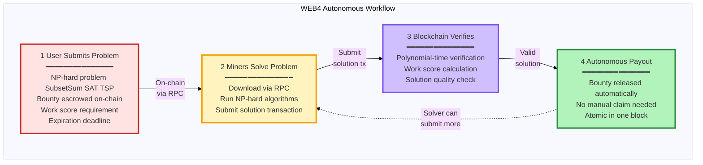
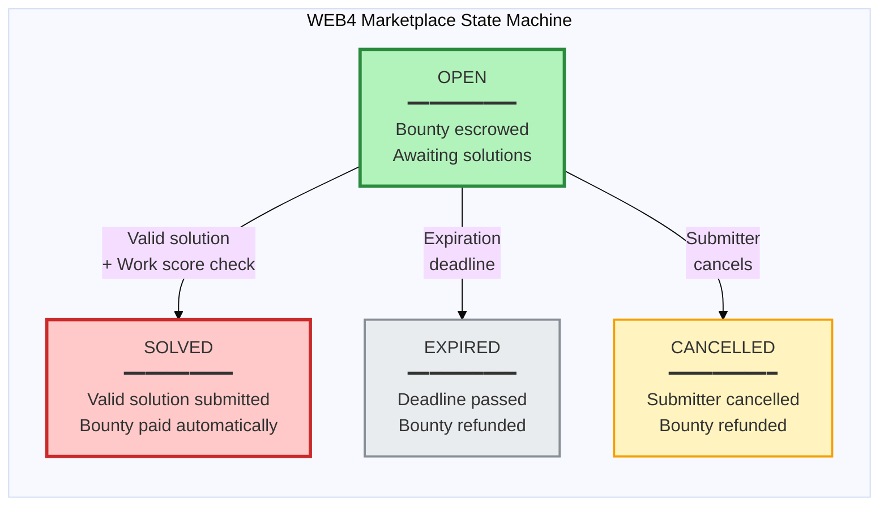
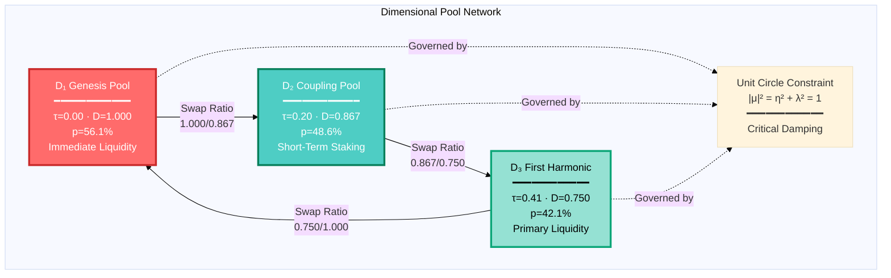
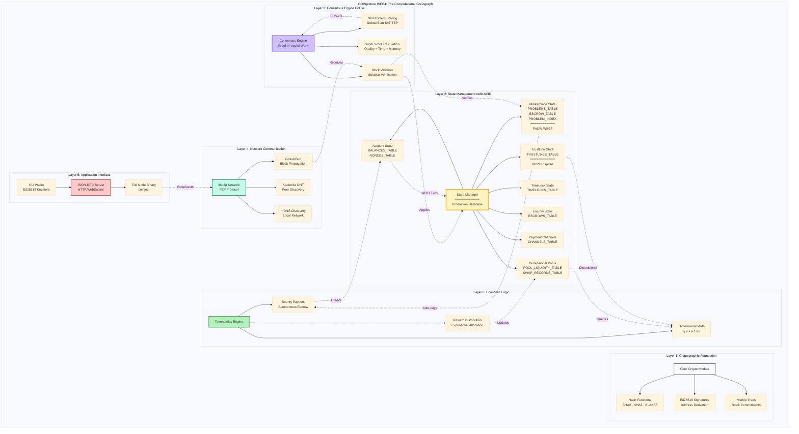
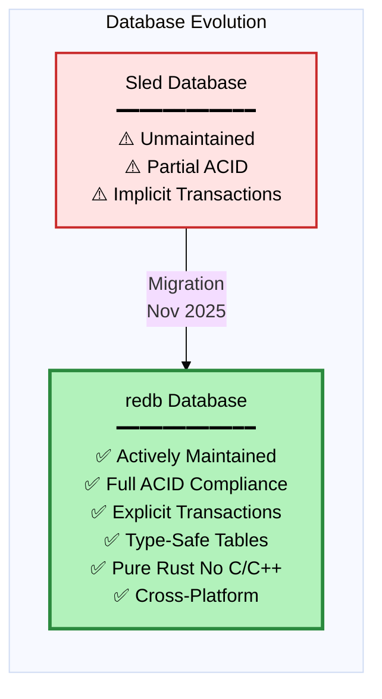

# COINjecture Network B: WEB4 Dimensional Blockchain Protocol

<div align="center">

**The First Blockchain Where Computational Work Actually Matters**

[](https://www.rust-lang.org/)
[](https://crates.io/crates/redb)
[](https://opensource.org/licenses/MIT)
[](https://github.com/Quigles1337/COINjecture1337-NETB)

*Proof of Useful Work (PoUW) blockchain with autonomous NP-complete problem marketplace*

</div>

---

## Table of Contents

- [Overview](#overview)
- [🚀 WEB4: The Proof of Useful Work Revolution](#-web4-the-proof-of-useful-work-revolution)
- [Core Innovation: PoUW Marketplace](#core-innovation-pouw-marketplace)
- [Dimensional Pools](#dimensional-pools)
- [Network Architecture](#network-architecture)
- [Institutional-Grade Infrastructure](#institutional-grade-infrastructure)
- [Mathematical Foundation](#mathematical-foundation)
- [Quick Start](#quick-start)
- [For AI Research Labs](#for-ai-research-labs)
- [Development Status](#development-status)
- [License](#license)

---

## Overview

COINjecture Network B is a **production-ready WEB4** Layer 1 blockchain protocol built in pure Rust, implementing:

1. **Proof of Useful Work (PoUW)**: Mining solves real NP-complete problems, not wasteful hashing
2. **Autonomous Marketplace**: On-chain bounty system for computational work with instant payouts
3. **Dimensional Tokenomics**: Multi-tier liquidity pools with exponential allocation ratios
4. **Institutional Infrastructure**: ACID-compliant redb database, full state persistence

**This is not WEB3. This is WEB4.**

- **WEB3**: Wasteful hash grinding with no real-world value
- **WEB4**: Every hash solves real computational problems. Every block advances science.

**Current Status**: Testnet-ready with fully operational PoUW marketplace
**Live Features**: Autonomous bounty payouts, NP-complete problem solving, dimensional economics
**Security**: Pre-audit; not for mainnet production with real funds

---

## 🚀 WEB4: The Proof of Useful Work Revolution

### The Problem with Traditional Blockchain

Traditional Proof-of-Work wastes **billions of dollars** of electricity solving meaningless hash puzzles. COINjecture solves this with **Proof of Useful Work (PoUW)** - where mining actually matters.

### How PoUW Works



### Supported NP-Complete Problems

| Problem Type | Verification Time | Difficulty | Use Cases |
|--------------|-------------------|------------|-----------|
| **SubsetSum** | O(n) | Dynamic programming | Cryptographic optimization, resource allocation |
| **Boolean SAT** | O(n·m) | DPLL, backtracking | Circuit design, formal verification |
| **TSP** | O(n²) | Greedy heuristics | Logistics, routing optimization |
| **Custom** | User-defined | Pluggable | Research problems, novel NP-hard instances |

### Work Score Formula

```
Work Score = (solve_time / verify_time) × √(solve_memory / verify_memory) × problem_weight × quality × energy_efficiency

Where:
- solve_time: Time to find solution (NP-hard)
- verify_time: Time to check solution (polynomial)
- problem_weight: Difficulty multiplier
- quality: Solution optimality (0.0-1.0)
- energy_efficiency: Hardware efficiency factor
```

**This is provably useful work** - not hash grinding.

---

## Core Innovation: PoUW Marketplace

### Autonomous On-Chain Marketplace

The marketplace operates **completely autonomously** with zero intermediaries:



### Database Persistence

All marketplace state is persisted in the **redb ACID-compliant database**:

**Tables:**
- `marketplace_problems`: Full problem metadata and solutions
- `marketplace_index`: Fast lookups by submitter address
- `marketplace_escrow`: On-chain bounty funds

**Properties:**
- ✅ ACID transactions ensure atomicity
- ✅ Crash-resistant with durability guarantees
- ✅ Merkle-proof verifiable state
- ✅ Cross-platform (Windows/Linux/macOS)

### Marketplace API (JSON-RPC)

```bash
# Get all open problems
curl -X POST http://localhost:9933 -H "Content-Type: application/json" -d '{
  "jsonrpc": "2.0",
  "method": "marketplace_getOpenProblems",
  "params": [],
  "id": 1
}'

# Get specific problem
curl -X POST http://localhost:9933 -H "Content-Type: application/json" -d '{
  "jsonrpc": "2.0",
  "method": "marketplace_getProblem",
  "params": ["<problem_id_hex>"],
  "id": 1
}'

# Get marketplace statistics
curl -X POST http://localhost:9933 -H "Content-Type: application/json" -d '{
  "jsonrpc": "2.0",
  "method": "marketplace_getStats",
  "params": [],
  "id": 1
}'

# Submit marketplace transaction (problem/solution/claim/cancel)
curl -X POST http://localhost:9933 -H "Content-Type: application/json" -d '{
  "jsonrpc": "2.0",
  "method": "transaction_submit",
  "params": ["<signed_marketplace_tx_hex>"],
  "id": 1
}'
```

### Example: Submitting a Problem

```rust
use coinject_core::{ProblemType, Transaction, MarketplaceTransaction};

// Create a SubsetSum problem: find subset that sums to 53
let problem = ProblemType::SubsetSum {
    numbers: vec![15, 22, 14, 26, 32, 9, 16, 8],
    target: 53,
};

// Submit with 1000 token bounty, 30 day expiration
let tx = Transaction::Marketplace(
    MarketplaceTransaction::new_problem_submission(
        problem,
        your_address,
        1000,     // bounty amount
        10.0,     // minimum work score
        30,       // expiration in days
        10,       // transaction fee
        nonce,
        &keypair,
    )
);

// Submit via RPC - bounty is automatically escrowed
rpc_client.submit_transaction(hex::encode(bincode::serialize(&tx)?)).await?;
```

### Example: Solving a Problem

```rust
// Solve the problem (indices of numbers that sum to target)
let solution = Solution::SubsetSum(vec![0, 2, 4, 6]); // [15, 14, 32, 16] = 77? No! [15, 14, 16, 8] = 53 ✓

// Submit solution - BOUNTY PAID AUTOMATICALLY IN THE SAME BLOCK!
let tx = Transaction::Marketplace(
    MarketplaceTransaction::new_solution_submission(
        problem_id,
        solution,
        solver_address,
        10,       // transaction fee
        nonce,
        &keypair,
    )
);

// On successful submission:
// 1. Solution verified (polynomial time)
// 2. Work score calculated
// 3. Bounty released from escrow
// 4. Solver credited automatically
// ALL ATOMIC IN ONE BLOCK - TRUE WEB4 AUTONOMY!
```

---

## Dimensional Pools

The protocol implements a novel **dimensional pool system** where three economic dimensions (D₁, D₂, D₃) operate with exponentially decaying scales derived from the **Satoshi constant** (η = λ = 1/√2):



### Mathematical Parameters

| Pool | Dimensionless Time (τ) | Scale Factor (D_n) | Allocation (p_n) | Economic Horizon |
|------|------------------------|-------------------|------------------|------------------|
| **D₁ Genesis** | 0.00 | 1.000 | 56.1% | Instant settlement |
| **D₂ Coupling** | 0.20 | 0.867 | 48.6% | Short-term (days) |
| **D₃ First Harmonic** | 0.41 | 0.750 | 42.1% | Medium-term (weeks) |

**Swap Formula**: `amount_out = amount_in × (D_from / D_to)`

---

## Network Architecture

Following **Mark Lombardi's** principles of revealing complex relationships through elegant visual networks:



---

## Institutional-Grade Infrastructure

### Production Database: redb

**November 2025 Migration**: Replaced unmaintained Sled with **redb** - a production-grade, ACID-compliant embedded database built in pure Rust.



### Why redb? Institutional Benefits

| Requirement | Previous (Sled) | **Current (redb)** |
|-------------|----------------|-------------------|
| **Maintenance** | ⚠️ Unmaintained since 2021 | ✅ **Active development** |
| **ACID Compliance** | Partial | ✅ **Full guarantees** |
| **Transaction Model** | Implicit | ✅ **Explicit boundaries** |
| **Type Safety** | Dynamic at runtime | ✅ **Compile-time checked** |
| **Dependencies** | Pure Rust | ✅ **Pure Rust (auditable)** |
| **Cross-Platform** | Linux-focused | ✅ **Windows/Linux/macOS** |
| **Data Integrity** | Best-effort | ✅ **Cryptographic verification** |
| **Institutional Audit** | ⚠️ Concerns flagged | ✅ **Production-ready** |

### ACID Transaction Model

```rust
// Explicit transaction boundaries ensure atomicity
let write_txn = db.begin_write()?;
{
    let mut table = write_txn.open_table(BALANCES_TABLE)?;
    table.insert(from.as_bytes(), from_balance - amount)?;
    table.insert(to.as_bytes(), to_balance + amount)?;
}
write_txn.commit()?;  // Atomic commit with durability
```

**For AI Research Labs**: ACID transactions ensure Lyapunov stability properties are preserved in training datasets, guaranteeing provable consistency for multi-agent coordination data.

---

## Mathematical Foundation

### Unit Circle Constraint

The **Satoshi constant** η = λ = 1/√2 emerges from the **unit circle constraint**:

```
|μ|² = η² + λ² = 1

Where:
- η (eta): Decay rate (damping coefficient)
- λ (lambda): Phase evolution rate
- μ (mu): Complex eigenvalue on unit circle
```

**Critical Damping**: The choice η = λ = 1/√2 represents the **fastest possible convergence** to equilibrium without oscillation (critical complex pole).

### Dimensional Scales

```
D_n = e^(-η · τ_n)

Where:
- D_n: Dimensional scale factor
- η: Satoshi constant (0.7071...)
- τ_n: Dimensionless time for dimension n
```

| Dimension | τ (tau) | D_n = e^(-η·τ) | Calculation |
|-----------|---------|----------------|-------------|
| D₁ | 0.00 | 1.000 | e^(-0.7071 × 0.00) = 1.000 |
| D₂ | 0.20 | 0.867 | e^(-0.7071 × 0.20) = 0.867 |
| D₃ | 0.41 | 0.750 | e^(-0.7071 × 0.41) = 0.750 |

---

## Quick Start

### Prerequisites

- Rust 1.70+ ([rustup.rs](https://rustup.rs/))
- Git

### Installation

```bash
# Clone the repository
git clone https://github.com/Quigles1337/COINjecture1337-NETB.git
cd COINjecture1337-NETB

# Build release binaries
cargo build --release

# Binaries available at:
# - target/release/coinject (full node with PoUW marketplace)
# - target/release/coinject-wallet (CLI wallet)
```

### Run a WEB4 Node

```bash
# Run node with mining (solves NP-hard problems)
./target/release/coinject --mine --miner-address <your_hex_address>

# Run node without mining (validator only)
./target/release/coinject --data-dir ./node_data --rpc-port 9933
```

### Use the Marketplace

```bash
# Get open problems
curl -X POST http://localhost:9933 -H "Content-Type: application/json" -d '{
  "jsonrpc": "2.0",
  "method": "marketplace_getOpenProblems",
  "params": [],
  "id": 1
}'

# Get marketplace statistics
curl -X POST http://localhost:9933 -H "Content-Type: application/json" -d '{
  "jsonrpc": "2.0",
  "method": "marketplace_getStats",
  "params": [],
  "id": 1
}'
```

### Run Tests

```bash
# Run all tests
cargo test --all

# Run marketplace tests specifically
cargo test -p coinject-state marketplace

# Run with output
cargo test --all -- --nocapture
```

---

## For AI Research Labs

### COINjecture Network B as Training Data Substrate

**Target Customers**: OpenAI, Anthropic, DeepMind, academic AI research labs

**Product**: Cryptographically-verified multi-agent coordination training data with provable mathematical properties

### Why Network B for AI Training?

| Traditional Synthetic Data | **COINjecture Network B** |
|----------------------------|---------------------------|
| ⚠️ No real stakes → fake optimization | ✅ **Real economic agents** with real incentives |
| ⚠️ Single timescale environments | ✅ **Multi-timescale** (D₁, D₂, D₃ pools) |
| ⚠️ No mathematical guarantees | ✅ **Provably stable** (Lyapunov analysis) |
| ⚠️ Unverifiable simulation data | ✅ **Cryptographically verified** (blockchain) |
| ⚠️ Static, pre-programmed strategies | ✅ **Emergent strategies** from real coordination |
| ⚠️ Wasteful computation | ✅ **Useful NP-complete problem solving** |

### Dataset Properties

**Cryptographic Verification**:
- Every transaction timestamped and hash-chained
- Merkle proofs for state transitions
- Immutable audit trail

**Provable Stability** (Lyapunov Guarantees):
- Unit circle constraint: |μ|² = η² + λ² = 1
- Critical damping: η = λ = 1/√2
- Exponential convergence to equilibrium

**Multi-Timescale Structure**:
- D₁: Instant decisions (sub-second)
- D₂: Short-term strategy (days)
- D₃: Medium-term positioning (weeks)

**Emergent Behaviors**:
- Dimensional arbitrage strategies
- Multi-pool coordination patterns
- Adversarial attack/defense dynamics
- Novel economic optimization paths
- **NP-complete problem solving strategies**

---

## Development Status

### Completed Features ✅

- [x] **Core Infrastructure**
  - [x] Ed25519 cryptography (signatures, addresses)
  - [x] Blake3/SHA2/SHA3 hashing
  - [x] Merkle tree commitments
  - [x] Transaction types (Transfer, Swap, TimeLock, Escrow, Channel, TrustLine, **Marketplace**)

- [x] **State Layer (redb)**
  - [x] ACID-compliant account state
  - [x] **PoUW Marketplace state with database persistence**
  - [x] Dimensional pool state with swap execution
  - [x] TimeLock state tracking
  - [x] Escrow multi-party state
  - [x] Payment channel state
  - [x] TrustLine protocol state
  - [x] Institutional-grade database migration

- [x] **PoUW Marketplace (WEB4)**
  - [x] **NP-complete problem types (SubsetSum, SAT, TSP)**
  - [x] **Polynomial-time solution verification**
  - [x] **Work score calculation**
  - [x] **On-chain bounty escrow**
  - [x] **Autonomous bounty payouts**
  - [x] **Marketplace RPC endpoints**
  - [x] **Database-persisted problem state**

- [x] **Consensus**
  - [x] Proof-of-Useful-Work (PoUW) mining
  - [x] Adaptive difficulty adjustment
  - [x] Block validation
  - [x] Work score calculation

- [x] **Networking (libp2p)**
  - [x] GossipSub (block/transaction propagation)
  - [x] Kademlia DHT (peer discovery)
  - [x] mDNS (local network discovery)
  - [x] Noise protocol (encrypted transport)

- [x] **RPC Layer**
  - [x] JSON-RPC server (HTTP/WebSocket)
  - [x] Account queries (balance, nonce)
  - [x] **Marketplace queries (open problems, stats)**
  - [x] Pool queries (liquidity, swap history)
  - [x] TimeLock/Escrow/Channel state queries
  - [x] Block/transaction retrieval

- [x] **Wallet**
  - [x] Ed25519 keystore
  - [x] Transaction construction
  - [x] Pool swap interface
  - [x] Advanced transaction types
  - [x] **Marketplace transaction support**

### Roadmap 🗺️

**Phase 1** (Current): ✅ **Testnet with PoUW marketplace + dimensional pools + redb**
**Phase 2** (Q1 2026): Security audit + economic attack simulation
**Phase 3** (Q2 2026): Mainnet preparation + institutional partnerships
**Phase 4** (Q3 2026): Mainnet launch with live bounty marketplace

---

## Module Structure

```
COINjecture Network B (WEB4)
├── core/               # Cryptography, types, transactions
│   ├── block.rs       # Block structure with Merkle roots
│   ├── crypto.rs      # Ed25519, hashing functions
│   ├── problem.rs     # NP-complete problem types
│   ├── transaction.rs # Transaction types (including Marketplace)
│   └── types.rs       # Common types (Address, Balance, Hash)
│
├── state/              # ACID-compliant state management
│   ├── accounts.rs    # Account balances & nonces (redb)
│   ├── marketplace.rs # PoUW marketplace state (redb) [WEB4]
│   ├── dimensional_pools.rs  # Pool state & swaps (redb)
│   ├── timelocks.rs   # Time-locked balances (redb)
│   ├── escrows.rs     # Multi-party escrow (redb)
│   ├── channels.rs    # Payment channels (redb)
│   └── trustlines.rs  # XRPL-inspired credit (redb)
│
├── consensus/          # Proof-of-Useful-Work consensus
│   ├── miner.rs       # NP-problem solving & mining logic
│   └── work_score.rs  # Work score calculation
│
├── network/            # libp2p P2P networking
│   └── protocol.rs    # GossipSub, Kademlia, mDNS
│
├── mempool/            # Transaction pool
│   ├── pool.rs        # Mempool logic
│   ├── marketplace.rs # In-memory marketplace cache
│   └── fee_market.rs  # Dynamic fee calculation
│
├── rpc/                # JSON-RPC server
│   └── server.rs      # HTTP/WebSocket endpoints (with marketplace API)
│
├── tokenomics/         # Economic logic
│   ├── dimensions.rs  # Dimensional math (η, λ, D_n)
│   └── distributor.rs # Reward distribution
│
├── node/               # Full node binary
│   ├── main.rs        # Entry point
│   ├── service.rs     # Node orchestration (marketplace integration)
│   ├── chain.rs       # Block storage (redb)
│   └── validator.rs   # Block/transaction validation (marketplace support)
│
└── wallet/             # CLI wallet
    ├── main.rs        # CLI interface
    ├── keystore.rs    # Ed25519 key management
    └── rpc_client.rs  # RPC communication
```

---

## Contributing

Contributions welcome! Please:

1. Fork the repository
2. Create a feature branch (`git checkout -b feature/amazing-feature`)
3. Commit changes (`git commit -m 'feat: add amazing feature'`)
4. Push to branch (`git push origin feature/amazing-feature`)
5. Open a Pull Request

**Code Style**: Run `cargo fmt` before committing
**Tests**: Run `cargo test --all` to ensure passing tests
**Documentation**: Update README for user-facing changes

---

## License

MIT License - see [LICENSE](LICENSE) file for details

**Copyright** (c) 2025 COINjecture Network B Contributors

---

## Acknowledgments

- **Mark Lombardi**: Inspiration for network visualization methodology
- **Satoshi Nakamoto**: Blockchain foundation
- **XRPL Team**: TrustLine protocol concepts
- **redb Team**: Production-grade embedded database
- **Rust Community**: Excellent tooling and ecosystem

---

## Links

- **GitHub**: https://github.com/Quigles1337/COINjecture1337-NETB
- **Documentation**: See `docs/` directory
- **Testnet Guide**: [TESTNET_GUIDE.md](TESTNET_GUIDE.md)
- **Transaction Guide**: [TRANSACTION_TEST_GUIDE.md](TRANSACTION_TEST_GUIDE.md)

---

<div align="center">

**Built with 🦀 Rust**

*Proof of Useful Work · Autonomous marketplace · Dimensional economics · Provable stability*

**THIS IS WEB4**

</div>
