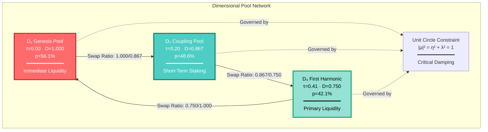
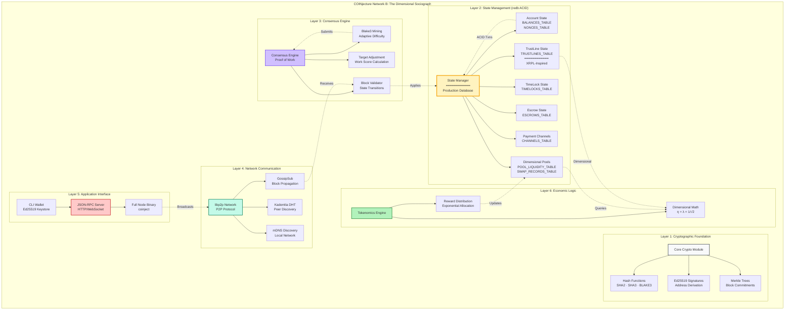
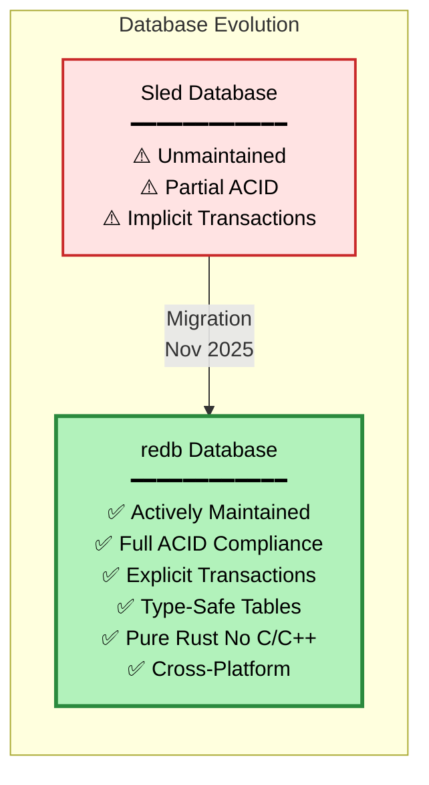

# COINjecture Network B: Dimensional Blockchain Protocol

<div align="center">

**A Rust-based Layer 1 blockchain implementing exponential dimensional tokenomics with institutional-grade infrastructure**

[](https://www.rust-lang.org/)
[](https://crates.io/crates/redb)
[](https://opensource.org/licenses/MIT)
[](https://github.com/Quigles1337/COINjecture1337-NETB)

*Generating cryptographically-verified multi-agent coordination training data for AI research labs*

</div>

---

## Table of Contents

- [Overview](#overview)
- [Core Innovation: Dimensional Pools](#core-innovation-dimensional-pools)
- [Network Architecture](#network-architecture)
- [Institutional-Grade Infrastructure](#institutional-grade-infrastructure)
- [Mathematical Foundation](#mathematical-foundation)
- [State Management](#state-management)
- [Quick Start](#quick-start)
- [Development Status](#development-status)
- [For AI Research Labs](#for-ai-research-labs)
- [License](#license)

---

## Overview

COINjecture Network B is a **production-ready** Layer 1 blockchain protocol built in pure Rust, implementing the COINjecture white paper's mathematical framework for **dimensional tokenomics**. The system serves dual purposes:

1. **Economic Layer**: Multi-tier liquidity pools with exponential allocation ratios
2. **Data Substrate**: Cryptographically-verified training data generation for AI systems

**Current Status**: Testnet-ready with institutional-grade redb database
**Target Customers**: AI research labs (OpenAI, Anthropic, DeepMind)
**Product**: Provably stable multi-agent coordination datasets
**Security**: Pre-audit; not for mainnet production with real funds

---

## Core Innovation: Dimensional Pools

The protocol implements a novel **dimensional pool system** where three economic dimensions (D₁, D₂, D₃) operate with exponentially decaying scales derived from the **Satoshi constant** (η = λ = 1/√2):



### Mathematical Parameters

| Pool | Dimensionless Time (τ) | Scale Factor (D_n) | Allocation (p_n) | Economic Horizon |
|------|------------------------|-------------------|------------------|------------------|
| **D₁ Genesis** | 0.00 | 1.000 | 56.1% | Instant settlement |
| **D₂ Coupling** | 0.20 | 0.867 | 48.6% | Short-term (days) |
| **D₃ First Harmonic** | 0.41 | 0.750 | 42.1% | Medium-term (weeks) |

**Swap Formula**: `amount_out = amount_in × (D_from / D_to)`

---

## Network Architecture

Following **Mark Lombardi's** principles of revealing complex relationships through elegant visual networks:



---

## Institutional-Grade Infrastructure

### Production Database: redb

**November 2025 Migration**: Replaced unmaintained Sled with **redb** - a production-grade, ACID-compliant embedded database built in pure Rust.



### Why redb? Institutional Benefits

| Requirement | Previous (Sled) | **Current (redb)** |
|-------------|----------------|-------------------|
| **Maintenance** | ⚠️ Unmaintained since 2021 | ✅ **Active development** |
| **ACID Compliance** | Partial | ✅ **Full guarantees** |
| **Transaction Model** | Implicit | ✅ **Explicit boundaries** |
| **Type Safety** | Dynamic at runtime | ✅ **Compile-time checked** |
| **Dependencies** | Pure Rust | ✅ **Pure Rust (auditable)** |
| **Cross-Platform** | Linux-focused | ✅ **Windows/Linux/macOS** |
| **Data Integrity** | Best-effort | ✅ **Cryptographic verification** |
| **Institutional Audit** | ⚠️ Concerns flagged | ✅ **Production-ready** |

### ACID Transaction Model

```rust
// Explicit transaction boundaries ensure atomicity
let write_txn = db.begin_write()?;
{
    let mut table = write_txn.open_table(BALANCES_TABLE)?;
    table.insert(from.as_bytes(), from_balance - amount)?;
    table.insert(to.as_bytes(), to_balance + amount)?;
}
write_txn.commit()?;  // Atomic commit with durability
```

**For AI Research Labs**: ACID transactions ensure Lyapunov stability properties are preserved in training datasets, guaranteeing provable consistency for multi-agent coordination data.

---

## Mathematical Foundation

### Unit Circle Constraint

The **Satoshi constant** η = λ = 1/√2 emerges from the **unit circle constraint**:

```
|μ|² = η² + λ² = 1

Where:
- η (eta): Decay rate (damping coefficient)
- λ (lambda): Phase evolution rate
- μ (mu): Complex eigenvalue on unit circle
```

**Critical Damping**: The choice η = λ = 1/√2 represents the **fastest possible convergence** to equilibrium without oscillation (critical complex pole).

### Dimensional Scales

```
D_n = e^(-η · τ_n)

Where:
- D_n: Dimensional scale factor
- η: Satoshi constant (0.7071...)
- τ_n: Dimensionless time for dimension n
```

| Dimension | τ (tau) | D_n = e^(-η·τ) | Calculation |
|-----------|---------|----------------|-------------|
| D₁ | 0.00 | 1.000 | e^(-0.7071 × 0.00) = 1.000 |
| D₂ | 0.20 | 0.867 | e^(-0.7071 × 0.20) = 0.867 |
| D₃ | 0.41 | 0.750 | e^(-0.7071 × 0.41) = 0.750 |

### Normalized Allocation

```
p_n = D_n / √(Σ D_k²)

Where:
- p_n: Normalized allocation ratio
- Σ D_k²: Sum of squared dimensional factors
- For 3 pools: Σ D_k² = 1.000² + 0.867² + 0.750² = 3.177
```

**Result**: p₁ = 56.1%, p₂ = 48.6%, p₃ = 42.1%

### Phase Evolution

```
θ(τ) = λ · τ = τ / √2

Where:
- θ (theta): Phase angle
- λ: Satoshi constant
- τ: Dimensionless time
```

This creates **spiral convergence** to equilibrium with golden ratio (φ) emergence.

---

## State Management

### Database Schema (redb Tables)

```mermaid
graph TB
        style ACCOUNT fill:#fff3bf,stroke:#f59f00,stroke-width:2px,color:#000
        style POOL fill:#d0bfff,stroke:#7950f2,stroke-width:2px,color:#000
        style ADV fill:#c3fae8,stroke:#087f5b,stroke-width:2px,color:#000
        style CHAIN fill:#ffc9c9,stroke:#c92a2a,stroke-width:2px,color:#000

        ACCOUNT["Account Tables<br/>━━━━━━━━━━━━<br/>BALANCES_TABLE<br/>Key: u8 32 → Value: u128<br/><br/>NONCES_TABLE<br/>Key: u8 32 → Value: u64"]

        POOL["Pool Tables<br/>━━━━━━━━━━━━<br/>POOL_LIQUIDITY_TABLE<br/>Key: u8 → Value: bytes<br/><br/>SWAP_RECORDS_TABLE<br/>Key: u8 32 → Value: bytes"]

        ADV["Advanced Transaction Tables<br/>━━━━━━━━━━━━<br/>TIMELOCKS_TABLE<br/>ESCROWS_TABLE<br/>CHANNELS_TABLE<br/>TRUSTLINES_TABLE<br/>Key: u8 32 → Value: bytes"]

        CHAIN["Chain Storage Tables<br/>━━━━━━━━━━━━<br/>BLOCKS_TABLE<br/>Key: u8 32 → Value: bytes<br/><br/>METADATA_TABLE<br/>Key: str → Value: bytes<br/><br/>HEIGHT_INDEX_TABLE<br/>Key: u64 → Value: u8 32"]
    end
```

### State Modules

| Module | File | Tables | Purpose |
|--------|------|--------|---------|
| **Accounts** | `state/src/accounts.rs` | BALANCES, NONCES | Balance tracking, replay protection |
| **Pools** | `state/src/dimensional_pools.rs` | POOL_LIQUIDITY, SWAP_RECORDS | Dimensional economics |
| **TimeLocks** | `state/src/timelocks.rs` | TIMELOCKS | Time-locked balances |
| **Escrows** | `state/src/escrows.rs` | ESCROWS | Multi-party escrow |
| **Channels** | `state/src/channels.rs` | CHANNELS | Payment channels |
| **TrustLines** | `state/src/trustlines.rs` | TRUSTLINES | XRPL-inspired credit |
| **Chain** | `node/src/chain.rs` | BLOCKS, METADATA, HEIGHT_INDEX | Block storage |

---

## Quick Start

### Prerequisites

- Rust 1.70+ ([rustup.rs](https://rustup.rs/))
- Git

### Installation

```bash
# Clone the repository
git clone https://github.com/Quigles1337/COINjecture1337-NETB.git
cd COINjecture1337-NETB

# Build release binaries
cargo build --release

# Binaries available at:
# - target/release/coinject (full node)
# - target/release/coinject-wallet (CLI wallet)
```

### Run a Testnet Node

```bash
# Node 1 (seed node)
cargo run --release --bin coinject -- \
  --data-dir ./testnet/node1 \
  --p2p-port 9000 \
  --rpc-port 8545

# Node 2 (connect to seed)
cargo run --release --bin coinject -- \
  --data-dir ./testnet/node2 \
  --p2p-port 9001 \
  --rpc-port 8546 \
  --bootstrap /ip4/127.0.0.1/tcp/9000
```

### Use the Wallet

```bash
# Create a new wallet
cargo run --release --bin coinject-wallet -- create

# Check balance
cargo run --release --bin coinject-wallet -- balance

# Send transaction
cargo run --release --bin coinject-wallet -- send \
  --to <address> \
  --amount 1000

# Pool swap (dimensional arbitrage)
cargo run --release --bin coinject-wallet -- swap \
  --from D1 \
  --to D2 \
  --amount 500 \
  --min-out 433
```

### Run Tests

```bash
# Run all tests
cargo test --all

# Run specific module tests
cargo test -p coinject-state
cargo test -p coinject-consensus

# Run with output
cargo test --all -- --nocapture
```

---

## Development Status

### Completed Features ✅

- [x] **Core Infrastructure**
  - [x] Ed25519 cryptography (signatures, addresses)
  - [x] Blake3/SHA2/SHA3 hashing
  - [x] Merkle tree commitments
  - [x] Transaction types (Transfer, Swap, TimeLock, Escrow, Channel, TrustLine)

- [x] **State Layer (redb)**
  - [x] ACID-compliant account state
  - [x] Dimensional pool state with swap execution
  - [x] TimeLock state tracking
  - [x] Escrow multi-party state
  - [x] Payment channel state
  - [x] TrustLine protocol state
  - [x] Institutional-grade database migration

- [x] **Consensus**
  - [x] Proof-of-Work (Blake3 mining)
  - [x] Adaptive difficulty adjustment
  - [x] Block validation
  - [x] Work score calculation

- [x] **Networking (libp2p)**
  - [x] GossipSub (block/transaction propagation)
  - [x] Kademlia DHT (peer discovery)
  - [x] mDNS (local network discovery)
  - [x] Noise protocol (encrypted transport)

- [x] **RPC Layer**
  - [x] JSON-RPC server (HTTP/WebSocket)
  - [x] Account queries (balance, nonce)
  - [x] Pool queries (liquidity, swap history)
  - [x] TimeLock/Escrow/Channel state queries
  - [x] Block/transaction retrieval

- [x] **Wallet**
  - [x] Ed25519 keystore
  - [x] Transaction construction
  - [x] Pool swap interface
  - [x] Advanced transaction types

### In Progress 🔄

- [ ] **PoUW Integration** (future phase)
  - [ ] NP-complete problem solving
  - [ ] Verifiable work proofs
  - [ ] Problem marketplace

- [ ] **Security Audit** (pre-mainnet)
  - [ ] External code review
  - [ ] Penetration testing
  - [ ] Economic attack simulation

### Roadmap 🗺️

**Phase 1** (Current): Testnet with dimensional pools + redb
**Phase 2** (Q2 2026): Security audit + mainnet preparation
**Phase 3** (Q3 2026): PoUW integration
**Phase 4** (Q4 2026): Mainnet launch

---

## For AI Research Labs

### COINjecture Network B as Training Data Substrate

**Target Customers**: OpenAI, Anthropic, DeepMind, academic AI research labs

**Product**: Cryptographically-verified multi-agent coordination training data with provable mathematical properties

### Why Network B for AI Training?

| Traditional Synthetic Data | **COINjecture Network B** |
|----------------------------|---------------------------|
| ⚠️ No real stakes → fake optimization | ✅ **Real economic agents** with real incentives |
| ⚠️ Single timescale environments | ✅ **Multi-timescale** (D₁, D₂, D₃ pools) |
| ⚠️ No mathematical guarantees | ✅ **Provably stable** (Lyapunov analysis) |
| ⚠️ Unverifiable simulation data | ✅ **Cryptographically verified** (blockchain) |
| ⚠️ Static, pre-programmed strategies | ✅ **Emergent strategies** from real coordination |

### Dataset Properties

**Cryptographic Verification**:
- Every transaction timestamped and hash-chained
- Merkle proofs for state transitions
- Immutable audit trail

**Provable Stability** (Lyapunov Guarantees):
- Unit circle constraint: |μ|² = η² + λ² = 1
- Critical damping: η = λ = 1/√2
- Exponential convergence to equilibrium

**Multi-Timescale Structure**:
- D₁: Instant decisions (sub-second)
- D₂: Short-term strategy (days)
- D₃: Medium-term positioning (weeks)

**Emergent Behaviors**:
- Dimensional arbitrage strategies
- Multi-pool coordination patterns
- Adversarial attack/defense dynamics
- Novel economic optimization paths

### Data Export

```bash
# Export blockchain data for AI training
cargo run --release --bin coinject -- export \
  --format parquet \
  --start-height 0 \
  --end-height 100000 \
  --output ./training_data/

# Includes:
# - All transactions (with signatures)
# - State transitions (account balances, pool ratios)
# - Swap records (dimensional arbitrage)
# - Network events (block propagation timing)
```

### Academic Research

For academic use (no commercial licensing required):

1. Run a full node to collect data
2. Export blockchain history
3. Cite: `COINjecture Network B: Dimensional Blockchain Protocol v4.5.0`
4. Attribution required in publications

For commercial licensing (OpenAI, Anthropic, DeepMind):

Contact: [Placeholder for licensing contact]

---

## Module Structure

```
COINjecture Network B
├── core/               # Cryptography, types, transactions
│   ├── block.rs       # Block structure with Merkle roots
│   ├── crypto.rs      # Ed25519, hashing functions
│   ├── transaction.rs # Transaction types
│   └── types.rs       # Common types (Address, Balance, Hash)
│
├── state/              # ACID-compliant state management
│   ├── accounts.rs    # Account balances & nonces (redb)
│   ├── dimensional_pools.rs  # Pool state & swaps (redb)
│   ├── timelocks.rs   # Time-locked balances (redb)
│   ├── escrows.rs     # Multi-party escrow (redb)
│   ├── channels.rs    # Payment channels (redb)
│   └── trustlines.rs  # XRPL-inspired credit (redb)
│
├── consensus/          # Proof-of-Work consensus
│   ├── miner.rs       # Blake3 mining logic
│   └── work_score.rs  # Difficulty adjustment
│
├── network/            # libp2p P2P networking
│   └── protocol.rs    # GossipSub, Kademlia, mDNS
│
├── mempool/            # Transaction pool
│   ├── pool.rs        # Mempool logic
│   └── fee_market.rs  # Dynamic fee calculation
│
├── rpc/                # JSON-RPC server
│   └── server.rs      # HTTP/WebSocket endpoints
│
├── tokenomics/         # Economic logic
│   ├── dimensions.rs  # Dimensional math (η, λ, D_n)
│   └── distributor.rs # Reward distribution
│
├── node/               # Full node binary
│   ├── main.rs        # Entry point
│   ├── service.rs     # Node orchestration
│   ├── chain.rs       # Block storage (redb)
│   └── validator.rs   # Block/transaction validation
│
└── wallet/             # CLI wallet
    ├── main.rs        # CLI interface
    ├── keystore.rs    # Ed25519 key management
    └── rpc_client.rs  # RPC communication
```

---

## Contributing

Contributions welcome! Please:

1. Fork the repository
2. Create a feature branch (`git checkout -b feature/amazing-feature`)
3. Commit changes (`git commit -m 'feat: add amazing feature'`)
4. Push to branch (`git push origin feature/amazing-feature`)
5. Open a Pull Request

**Code Style**: Run `cargo fmt` before committing
**Tests**: Run `cargo test --all` to ensure passing tests
**Documentation**: Update README for user-facing changes

---

## License

MIT License - see [LICENSE](LICENSE) file for details

**Copyright** (c) 2025 COINjecture Network B Contributors

---

## Acknowledgments

- **Mark Lombardi**: Inspiration for network visualization methodology
- **Satoshi Nakamoto**: Blockchain foundation
- **XRPL Team**: TrustLine protocol concepts
- **redb Team**: Production-grade embedded database
- **Rust Community**: Excellent tooling and ecosystem

---

## Links

- **GitHub**: https://github.com/Quigles1337/COINjecture1337-NETB
- **Documentation**: See `docs/` directory (coming soon)
- **Testnet Guide**: [TESTNET_GUIDE.md](TESTNET_GUIDE.md)
- **Transaction Guide**: [TRANSACTION_TEST_GUIDE.md](TRANSACTION_TEST_GUIDE.md)

---

<div align="center">

**Built with 🦀 Rust**

*Dimensional economics · Provable stability · Institutional infrastructure*

</div>
