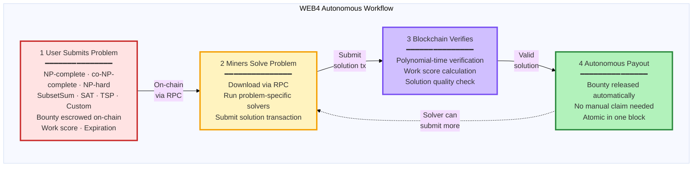
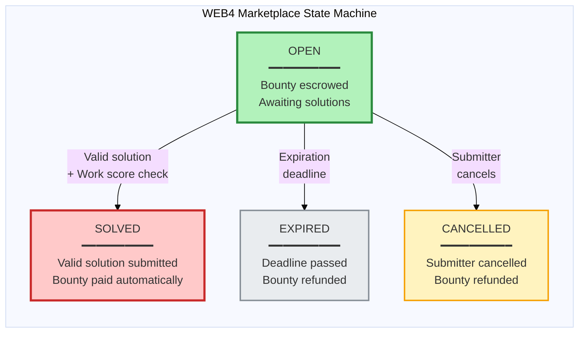
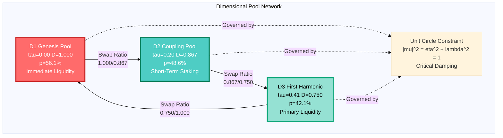
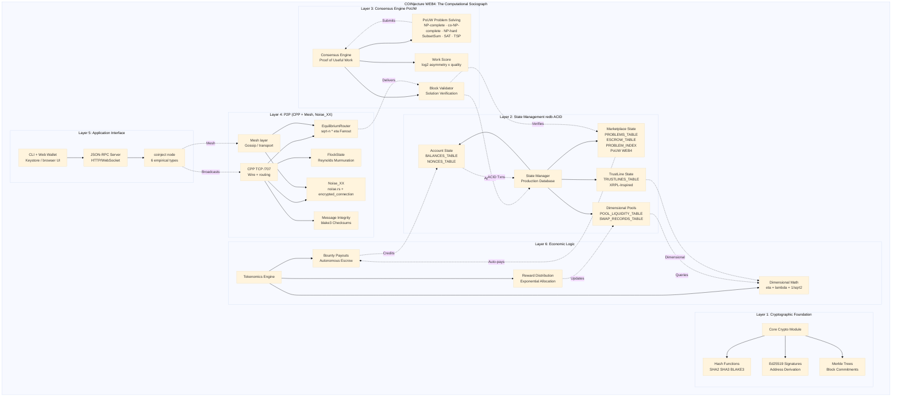

# COINjecture 2.0: Turn Verified Computational Work into Token Value

<div align="center">

**Proof-of-Useful-Work Layer 1 — useful NP-class solving plus header commitments, not vanity SHA grinding**

[](https://github.com/COINjecture-Network/COINjecture2.0/blob/main/Cargo.toml)
[](https://www.rust-lang.org/)
[](lean4/)
[](https://crates.io/crates/redb)
[](LICENSE)
[](https://github.com/COINjecture-Network/COINjecture2.0/actions/workflows/ci.yml)
[](https://github.com/COINjecture-Network/COINjecture2.0/actions/workflows/api-server-ci.yml)


[Website](https://coinjecture.com) · [API](https://api.coinjecture.com) · [Solver Lab](https://coinjecture.com/solver-lab) · [Whitepaper](docs/whitepaper/Whitepaper.md)

</div>

> **Security Notice**: Pre-audit testnet. Not for use with real funds.

---

## Table of Contents

- [Overview](#overview)
- [WEB4: The Proof of Useful Work Revolution](#web4-the-proof-of-useful-work-revolution)
- [Core Innovation: PoUW Marketplace](#core-innovation-pouw-marketplace)
- [Dimensional Pools](#dimensional-pools)
- [Network Architecture](#network-architecture)
- [Institutional-Grade Infrastructure](#institutional-grade-infrastructure)
- [Mathematical Foundation](#mathematical-foundation)
- [Quick Start](#quick-start)
- [Production deployment and chain health](#production-deployment-and-chain-health)
- [For AI Research Labs](#for-ai-research-labs)
- [Development Status](#development-status)
- [Formal Verification (Lean 4)](#formal-verification-lean-4)
- [License](#license)

---

## Overview

COINjecture 2.0 is a **testnet WEB4** Layer 1 blockchain protocol built in pure Rust, implementing:

1. **Proof of Useful Work (PoUW)**: Miners solve **NP-complete, co-NP-complete, and NP-hard** instances, then seal the block with a **header hash** meeting a leading-hex-zero target — polynomial-time solution verification, not meaningless SHA loops alone
2. **Autonomous Marketplace**: On-chain bounty system for computational work with instant payouts
3. **Dimensional Tokenomics**: Multi-tier liquidity pools with exponential allocation ratios
4. **Institutional Infrastructure**: ACID-compliant redb database, full state persistence

**This is not WEB3. This is WEB4.**

- **WEB3**: Wasteful hash grinding with no real-world value
- **WEB4**: Every block advances verifiable computation across **NP-complete**, **co-NP-complete**, and **NP-hard** problem classes

**Current Status**: **v4.8.4** — live testnet at [coinjecture.com](https://coinjecture.com) ([API](https://api.coinjecture.com), `chain_id`: `coinject-network-b-v4`); mesh CPP P2P with **Noise_XX**; PoUW marketplace, dimensional pools, Solver Lab

---

## WEB4: The Proof of Useful Work Revolution

### The Problem with Traditional Blockchain

Traditional Proof-of-Work wastes **billions of dollars** of electricity solving meaningless hash puzzles. COINjecture solves this with **Proof of Useful Work (PoUW)** - where mining actually matters.

### How PoUW Works


```mermaid
%%{init: {'theme':'base', 'themeVariables': { 'fontSize':'16px', 'fontFamily':'Arial'}}}%%
graph TB
    subgraph "WEB4 Autonomous Workflow"
        style SUBMIT fill:#ffe3e3,stroke:#c92a2a,stroke-width:3px
        style MINE fill:#fff3bf,stroke:#f59f00,stroke-width:3px
        style VERIFY fill:#d0bfff,stroke:#7950f2,stroke-width:3px
        style PAYOUT fill:#b2f2bb,stroke:#2b8a3e,stroke-width:3px

        SUBMIT["1 User Submits Problem<br/>━━━━━━━━━━━━━━━<br/>NP-complete · co-NP-complete · NP-hard<br/>SubsetSum · SAT · TSP · Custom<br/>Bounty escrowed on-chain<br/>Work score · Expiration"]

        MINE["2 Miners Solve Problem<br/>━━━━━━━━━━━━━━━<br/>Download via RPC<br/>Run problem-specific solvers<br/>Submit solution transaction"]

        VERIFY["3 Blockchain Verifies<br/>━━━━━━━━━━━━━━━<br/>Polynomial-time verification<br/>Work score calculation<br/>Solution quality check"]

        PAYOUT["4 Autonomous Payout<br/>━━━━━━━━━━━━━━━<br/>Bounty released automatically<br/>No manual claim needed<br/>Atomic in one block"]

        SUBMIT -->|"On-chain<br/>via RPC"| MINE
        MINE -->|"Submit<br/>solution tx"| VERIFY
        VERIFY -->|"Valid<br/>solution"| PAYOUT
        PAYOUT -.->|"Solver can<br/>submit more"| MINE
    end
```

**Block production (consensus miner)** is two steps: (1) deterministically generate and **solve** a SubsetSum / SAT / TSP instance (seeded by `prev_hash` + height); (2) **search a header nonce** so `hex(block_hash)` meets `--difficulty` leading zero hex characters (default **5**). Work score uses solve/verify time asymmetry from step 1; step 2 binds the solution to the chain tip.

### Supported Problem Classes & Types

PoUW requires a **short, polynomial-time-checkable certificate** — the solve ≫ verify asymmetry that defines useful computational work. COINjecture registers every problem type under one of **three complexity classes** in `consensus/src/problem_registry.rs` (`ComplexityClass`):

| Complexity class | What it covers | PoUW role | Examples in registry |
|------------------|----------------|-----------|----------------------|
| **NP-complete** | Hardest **decision** problems in **NP** | Yes/no certificate, poly-time verify | SubsetSum, SAT, Graph Coloring |
| **co-NP-complete** | Hardest **decision** problems in **co-NP** | Verify “no” / dual certificates in poly time | Tautology checking (roadmap) |
| **NP-hard** | At least as hard as any NP problem; includes **optimization** | Best solution + poly-time check (or quality gradient) | TSP, Factorization, SVP |

**Broader landscape:** problems in **NP** (not necessarily complete) and **co-NP** can be bountied once a type has a registered `ProblemDescriptor` and a working verifier. **`ProblemType::Custom`** is reserved for forward-compatible payloads; on-chain verify for Custom is **not implemented yet** (see roadmap table below).

#### Implemented
| Problem | Class | On-chain today | Verification | Notes |
|---------|-------|----------------|--------------|-------|
| **SubsetSum** | NP-complete | ✅ block templates + marketplace | O(n) | Decision: subset sums to target |
| **Boolean SAT** | NP-complete | ✅ block templates + marketplace | O(n·m) | Decision: satisfy all clauses |
| **TSP** | NP-hard | ✅ block templates + marketplace | O(n) tour check | Optimization: valid Hamiltonian tour + quality gradient |

Block templates pick **SubsetSum, SAT, or TSP** at random (deterministic RNG from `prev_hash` + height) — see `consensus/src/miner.rs::generate_problem`.

#### In registry (difficulty / descriptors); not yet block templates
| Problem | Class | Verification | Notes |
|---------|-------|--------------|-------|
| **Graph Coloring** | NP-complete | O(V+E) | Registered in `ProblemRegistry`; no `ProblemType` variant yet |
| **Factorization** | NP-hard (verify in co-NP) | O(M(log N)) | Multiply factors to verify |
| **SVP** | NP-hard | O(n²) | Shortest lattice vector |

#### Roadmap
| Problem | Class | Notes |
|---------|-------|-------|
| **Tautology / dual-SAT** | co-NP-complete | Example co-NP-complete class; not in registry yet |
| **Custom** | User-declared | `ProblemType::Custom` exists; **`Solution::verify` does not validate Custom yet** — marketplace accepts payloads via `marketplace_submitPublicProblem`, but consensus verification today is SubsetSum / SAT / TSP only |

**Mining block templates** (`core/src/problem.rs`): **SubsetSum, SAT, TSP** (+ `Custom` enum variant for forward compatibility). Descriptor metadata for six built-ins lives in `consensus/src/problem_registry.rs`. See [Whitepaper — Problem registry](docs/whitepaper/Whitepaper.md).

### Work Score Formula

Implemented in `consensus/src/work_score.rs`:

```text
work_score = log₂(solve_time / verify_time) × quality_score
```

**Rationale (summary)**  
- **Time asymmetry** `solve_time / verify_time` applies across **NP-complete**, **co-NP-complete**, and **NP-hard** instances with poly-time certificates: finding a solution (or optimal value) is hard; checking it is fast. `log₂` turns the ratio into **comparable security bits** across types and classes.  
- **`quality_score`** captures how good the submitted solution is (consensus-verifiable; gradient for optimization problems like TSP).  

**Deliberately not in the formula** (see code comments): space asymmetry, “energy efficiency,” and problem-specific multipliers that would be **self-reported or gameable** by miners. The racing incentive caps inflated solve times: slower work loses the block to faster honest competitors.

**This is provably useful work** — not hash grinding.

---

## Core Innovation: PoUW Marketplace

### Autonomous On-Chain Marketplace

The marketplace operates **completely autonomously** with zero intermediaries:


```mermaid
%%{init: {'theme':'base', 'themeVariables': { 'fontSize':'16px', 'fontFamily':'Arial'}}}%%
graph LR
    subgraph "WEB4 Marketplace State Machine"
        style OPEN fill:#b2f2bb,stroke:#2b8a3e,stroke-width:3px
        style SOLVED fill:#ffc9c9,stroke:#c92a2a,stroke-width:3px
        style EXPIRED fill:#e9ecef,stroke:#868e96,stroke-width:2px
        style CANCELLED fill:#fff3bf,stroke:#f59f00,stroke-width:2px

        OPEN["OPEN<br/>━━━━━━━━━━<br/>Bounty escrowed<br/>Awaiting solutions"]

        SOLVED["SOLVED<br/>━━━━━━━━━━<br/>Valid solution submitted<br/>Bounty paid automatically"]

        EXPIRED["EXPIRED<br/>━━━━━━━━━━<br/>Deadline passed<br/>Bounty refunded"]

        CANCELLED["CANCELLED<br/>━━━━━━━━━━<br/>Submitter cancelled<br/>Bounty refunded"]

        OPEN -->|"Valid solution<br/>+ Work score check"| SOLVED
        OPEN -->|"Expiration<br/>deadline"| EXPIRED
        OPEN -->|"Submitter<br/>cancels"| CANCELLED
    end
```

### Database Persistence

All marketplace state is persisted in the **redb ACID-compliant database**:

**Tables:**
- `marketplace_problems`: Full problem metadata and solutions
- `marketplace_index`: Fast lookups by submitter address
- `marketplace_escrow`: On-chain bounty funds

**Properties:**
- ACID transactions ensure atomicity
- Crash-resistant with durability guarantees
- Merkle-proof verifiable state
- Cross-platform (Windows/Linux/macOS)

### Marketplace API (JSON-RPC)

```bash
# Get all open problems
curl -X POST http://localhost:9933 -H "Content-Type: application/json" -d '{
  "jsonrpc": "2.0",
  "method": "marketplace_getOpenProblems",
  "params": [],
  "id": 1
}'

# Get specific problem
curl -X POST http://localhost:9933 -H "Content-Type: application/json" -d '{
  "jsonrpc": "2.0",
  "method": "marketplace_getProblem",
  "params": ["<problem_id_hex>"],
  "id": 1
}'

# Get marketplace statistics
curl -X POST http://localhost:9933 -H "Content-Type: application/json" -d '{
  "jsonrpc": "2.0",
  "method": "marketplace_getStats",
  "params": [],
  "id": 1
}'

# Submit marketplace transaction (problem/solution/claim/cancel)
curl -X POST http://localhost:9933 -H "Content-Type: application/json" -d '{
  "jsonrpc": "2.0",
  "method": "transaction_submit",
  "params": ["<signed_marketplace_tx_hex>"],
  "id": 1
}'
```

### Example: Submitting a Problem

```rust
use coinject_core::{ProblemType, Transaction, MarketplaceTransaction};

// Create a SubsetSum problem: find subset that sums to 53
let problem = ProblemType::SubsetSum {
    numbers: vec![15, 22, 14, 26, 32, 9, 16, 8],
    target: 53,
};

// Submit with bounty in ledger atoms (Balance = u128), 30 day expiration
let tx = Transaction::Marketplace(
    MarketplaceTransaction::new_problem_submission(
        problem,
        your_address,
        1000,     // bounty atoms
        10.0,     // minimum work score
        30,       // expiration in days
        None,     // optional title
        None,     // optional briefing
        10,       // transaction fee atoms
        nonce,
        &keypair,
    )
);

// Submit via JSON-RPC (hex-encoded signed tx)
// rpc.call("transaction_submit", [hex::encode(bincode::serialize(&tx)?)]).await?;
```

### Example: Solving a Problem

```rust
// Solve the problem (indices of numbers that sum to target)
let solution = Solution::SubsetSum(vec![0, 1, 6]); // indices 0,1,6 → [15, 22, 16] = 53 ✓

// Submit solution - BOUNTY PAID AUTOMATICALLY IN THE SAME BLOCK!
let tx = Transaction::Marketplace(
    MarketplaceTransaction::new_solution_submission(
        problem_id,
        solution,
        solver_address,
        10,       // fee atoms
        nonce,
        &keypair,
    )
);

// On successful submission:
// 1. Solution verified (polynomial time)
// 2. Work score calculated
// 3. Bounty released from escrow
// 4. Solver credited automatically
// ALL ATOMIC IN ONE BLOCK - TRUE WEB4 AUTONOMY!
```

---

## Dimensional Pools

The protocol implements a **dimensional pool system** where three economic dimensions (D1, D2, D3) use exponentially decaying scales **D_n = e^(−η τ_n)** with **η = λ = 1/√2** from the [design axioms](docs/whitepaper/Whitepaper.md#the-conjecture):


```mermaid
%%{init: {'theme':'base', 'themeVariables': { 'fontSize':'16px', 'fontFamily':'Arial'}}}%%
graph TB
    subgraph "Dimensional Pool Network"
        style D1 fill:#ff6b6b,stroke:#c92a2a,stroke-width:3px,color:#fff
        style D2 fill:#4ecdc4,stroke:#087f5b,stroke-width:3px,color:#fff
        style D3 fill:#95e1d3,stroke:#0ca678,stroke-width:3px,color:#000

        D1["D1 Genesis Pool<br/>tau=0.00 D=1.000<br/>p=56.1%<br/>Immediate Liquidity"]
        D2["D2 Coupling Pool<br/>tau=0.20 D=0.867<br/>p=48.6%<br/>Short-Term Staking"]
        D3["D3 First Harmonic<br/>tau=0.41 D=0.750<br/>p=42.1%<br/>Primary Liquidity"]

        CONSTRAINT["Unit Circle Constraint<br/>|mu|^2 = eta^2 + lambda^2 = 1<br/>Critical Damping"]

        D1 -->|"Swap Ratio<br/>1.000/0.867"| D2
        D2 -->|"Swap Ratio<br/>0.867/0.750"| D3
        D3 -->|"Swap Ratio<br/>0.750/1.000"| D1

        D1 -.->|"Governed by"| CONSTRAINT
        D2 -.->|"Governed by"| CONSTRAINT
        D3 -.->|"Governed by"| CONSTRAINT
    end
```

### Mathematical Parameters

| Pool | Dimensionless Time (tau) | Scale Factor (D_n) | Allocation (p_n) | Economic Horizon |
|------|------------------------|-------------------|------------------|------------------|
| **D1 Genesis** | 0.00 | 1.000 | 56.1% | Instant settlement |
| **D2 Coupling** | 0.20 | 0.867 | 48.6% | Short-term (days) |
| **D3 First Harmonic** | 0.41 | 0.750 | 42.1% | Medium-term (weeks) |

**Swap Formula**: `amount_out = amount_in * (D_from / D_to)`

---

## Network Architecture

COINjecture’s **`network`** crate combines **CPP** (COINjecture P2P Protocol) — a custom TCP wire format on port 707, with equilibrium-based routing — and a **mesh** layer (`network/src/mesh/`) for gossip-style coordination and bridges. **Noise_XX** (`network/src/noise.rs`) and **`encrypted_connection.rs`** provide optional **encrypted transport** on top of these transports. CPP and mesh share the same discovery, peer store, PEX, and scoring policies rather than two disconnected stacks.

### Node roles (empirical classification)

Nodes are classified **from observed behavior** (`node/src/node_types.rs`), not self-declared roles:

| Type | Role |
|------|------|
| **Light** | Header-oriented sync, minimal storage, mobile-friendly |
| **Full** | Full validation, standard chain storage |
| **Archive** | Full history retention (large storage) |
| **Validator** | Block production + fast validation |
| **Bounty** | PoUW / marketplace solving workload |
| **Oracle** | External data feeds and bridge-style interfaces |

The `coinject` binary is the main full-node entrypoint; behavior over time maps into the types above.


```mermaid
%%{init: {'theme':'base', 'themeVariables': { 'fontSize':'16px', 'fontFamily':'Arial'}}}%%
graph TB
    subgraph "COINjecture WEB4: The Computational Sociograph"
        subgraph "Layer 1: Cryptographic Foundation"
            CRYPTO["Core Crypto Module"]
            HASH["Hash Functions<br/>SHA2 SHA3 BLAKE3"]
            SIG["Ed25519 Signatures<br/>Address Derivation"]
            MERKLE["Merkle Trees<br/>Block Commitments"]

            CRYPTO --> HASH
            CRYPTO --> SIG
            CRYPTO --> MERKLE
        end

        subgraph "Layer 2: State Management redb ACID"
            STATE["State Manager<br/>Production Database"]
            ACCOUNTS["Account State<br/>BALANCES_TABLE<br/>NONCES_TABLE"]
            MARKETPLACE["Marketplace State<br/>PROBLEMS_TABLE<br/>ESCROW_TABLE<br/>PROBLEM_INDEX<br/>PoUW WEB4"]
            POOLS["Dimensional Pools<br/>POOL_LIQUIDITY_TABLE<br/>SWAP_RECORDS_TABLE"]
            TRUSTLINE["TrustLine State<br/>TRUSTLINES_TABLE<br/>XRPL-Inspired"]

            STATE --> ACCOUNTS
            STATE --> MARKETPLACE
            STATE --> POOLS
            STATE --> TRUSTLINE
        end

        subgraph "Layer 3: Consensus Engine PoUW"
            CONSENSUS["Consensus Engine<br/>Proof of Useful Work"]
            POW["PoUW Problem Solving<br/>NP-complete · co-NP-complete · NP-hard<br/>SubsetSum · SAT · TSP"]
            WORKSCORE["Work Score<br/>log2 asymmetry x quality"]
            VALIDATOR["Block Validator<br/>Solution Verification"]

            CONSENSUS --> POW
            CONSENSUS --> WORKSCORE
            CONSENSUS --> VALIDATOR
        end

        subgraph "Layer 4: P2P (CPP + Mesh, Noise_XX)"
            CPP["CPP TCP /707<br/>Wire + routing"]
            MESH["Mesh layer<br/>Gossip / transport"]
            NOISE["Noise_XX<br/>noise.rs + encrypted_connection"]
            ROUTER["EquilibriumRouter<br/>sqrt-n * eta Fanout"]
            FLOCK["FlockState<br/>Reynolds Murmuration"]
            INTEGRITY["Message Integrity<br/>blake3 Checksums"]

            CPP --> ROUTER
            CPP --> FLOCK
            MESH --> ROUTER
            CPP --> NOISE
            MESH --> NOISE
            CPP --> INTEGRITY
        end

        subgraph "Layer 5: Application Interface"
            RPC["JSON-RPC Server<br/>HTTP/WebSocket"]
            WALLET["CLI + Web Wallet<br/>Keystore / browser UI"]
            NODE["coinject node<br/>6 empirical types"]

            RPC --> NODE
            WALLET --> RPC
        end

        subgraph "Layer 6: Economic Logic"
            TOKENOMICS["Tokenomics Engine"]
            DIM["Dimensional Math<br/>eta = lambda = 1/sqrt2"]
            DIST["Reward Distribution<br/>Exponential Allocation"]
            BOUNTY["Bounty Payouts<br/>Autonomous Escrow"]

            TOKENOMICS --> DIM
            TOKENOMICS --> DIST
            TOKENOMICS --> BOUNTY
        end

        %% Cross-layer connections
        MARKETPLACE -.->|"Auto-pays"| BOUNTY
        POOLS -.->|"Queries"| DIM
        VALIDATOR -.->|"Applies"| STATE
        VALIDATOR -.->|"Verifies"| MARKETPLACE
        POW -.->|"Submits"| CONSENSUS
        NODE -.->|"Broadcasts"| CPP
        NODE -.->|"Mesh"| MESH
        ROUTER -.->|"Delivers"| VALIDATOR
        DIST -.->|"Updates"| POOLS
        BOUNTY -.->|"Credits"| ACCOUNTS
        TRUSTLINE -.->|"Dimensional"| DIM
        ACCOUNTS -.->|"ACID Txns"| STATE
    end
```

### CPP Wire Format

```
COIN magic (4B) + version (1B) + type (1B) + length (4B) + payload + blake3 hash (32B)
```

### Key Properties
- **Equilibrium routing**: Broadcast fanout = ceil(sqrt(n) * eta) peers per hop
- **Reynolds flocking**: Murmuration-based peer coordination
- **blake3 integrity**: 32-byte checksums on every message
- **Window-based flow control**: Adaptive congestion management
- **8 dimensional priority levels**: Messages prioritized by D_n scales

---

## Institutional-Grade Infrastructure

### Production Database: redb

**November 2025 Migration**: Replaced unmaintained Sled with **redb** - a production-grade, ACID-compliant embedded database built in pure Rust.

### Why redb? Institutional Benefits

| Requirement | Previous (Sled) | **Current (redb)** |
|-------------|----------------|-------------------|
| **Maintenance** | Unmaintained since 2021 | **Active development** |
| **ACID Compliance** | Partial | **Full guarantees** |
| **Transaction Model** | Implicit | **Explicit boundaries** |
| **Type Safety** | Dynamic at runtime | **Compile-time checked** |
| **Dependencies** | Pure Rust | **Pure Rust (auditable)** |
| **Cross-Platform** | Linux-focused | **Windows/Linux/macOS** |
| **Data Integrity** | Best-effort | **Cryptographic verification** |

### ACID Transaction Model

```rust
// Explicit transaction boundaries ensure atomicity
let write_txn = db.begin_write()?;
{
    let mut table = write_txn.open_table(BALANCES_TABLE)?;
    table.insert(from.as_bytes(), from_balance - amount)?;
    table.insert(to.as_bytes(), to_balance + amount)?;
}
write_txn.commit()?;  // Atomic commit with durability
```

### Observability (Prometheus + Grafana)

The `monitoring/` directory ships scrape configs, alert rules, and Grafana dashboard JSON. Use the **production overlay** (Prometheus **9091**, Grafana **3001** on the host):

```bash
docker compose -f docker-compose.production.yml up -d node api-server prometheus grafana

# Grafana (host 3001 → container 3000)
open http://localhost:3001

# Prometheus UI (host 9091 → container 9090)
open http://localhost:9091
```

Node metrics and `/health` also live on each node's **`--metrics-addr`** (default **9090** inside the container; mapped to **9090–9093** on the 4-node testnet compose).

---

## Mathematical Foundation

### Design axioms (η and the unit circle)

From [The Conjecture](docs/whitepaper/Whitepaper.md#the-conjecture) in the whitepaper: symmetry **|x| = |y|** and unit normalisation **x² + y² = 1** force **|x| = |y| = 1/√2**. That value enters the protocol as the difficulty-target multiplier **η** (with **λ = η** in the dimensional model). Lean checks the numeric axioms in `lean4/Coinjecture/DesignAxioms.lean`; unique selection **μ = (−1 + i)/√2** is in `ComplexDecomposition.lean` (`mu_unique`).

```
|μ|² = η² + λ² = 1   (with η = λ = 1/√2)

Where:
- η: Difficulty-target multiplier (also used in pool / routing math)
- λ: Coupling constant (dimensional tokenomics)
- μ: Consensus eigenvalue on the unit circle (interpretive; does not change fork choice)
```

### Dimensional scales

```
D_n = e^(-η * τ_n)

Where:
- D_n: Dimensional scale factor
- η: Design-axiom multiplier (1/√2 ≈ 0.7071…)
- τ_n: Dimensionless time for dimension n
```

| Dimension | tau | D_n = e^(-eta*tau) | Calculation |
|-----------|---------|----------------|-------------|
| D1 | 0.00 | 1.000 | e^(-0.7071 * 0.00) = 1.000 |
| D2 | 0.20 | 0.867 | e^(-0.7071 * 0.20) = 0.867 |
| D3 | 0.41 | 0.750 | e^(-0.7071 * 0.41) = 0.750 |

---

## Quick Start

### Prerequisites

- Rust 1.94+ ([rustup.rs](https://rustup.rs/)) — matches `Dockerfile` / production builds
- Docker + Compose v2 (for containerized testnet)
- For the full stack (`api-server` in `docker-compose.yml`): copy [`.env.example`](.env.example) to `.env` and set **`SUPABASE_URL`**, **`SUPABASE_ANON_KEY`**, and **`SUPABASE_JWT_SECRET`** (see [`api-server/.env.example`](api-server/.env.example)). Chain nodes alone do not need Supabase.

### Docker Testnet (Recommended)

```bash
# Clone the repository
git clone https://github.com/COINjecture-Network/COINjecture2.0.git
cd COINjecture2.0

cp .env.example .env
# Edit .env: add Supabase vars if you want api-server (port 3030). Chain-only:
#   docker compose up -d --build bootnode node1 node2 node3

# Build and start 4-node testnet + api-server
docker compose up -d --build

# Check health (metrics ports mapped on host)
curl http://localhost:9090/health   # bootnode
curl http://localhost:9091/health   # node1
curl http://localhost:9092/health   # node2
curl http://localhost:9093/health   # node3

# JSON-RPC on bootnode (host 9933 → container 9933)
curl -sS -X POST http://localhost:9933/ -H 'Content-Type: application/json' \
  -d '{"jsonrpc":"2.0","method":"chain_getInfo","params":[],"id":1}'

# API (if api-server started and Supabase configured)
curl -sS http://localhost:3030/health

# View logs
docker compose logs -f bootnode

# Stop
docker compose down
```

### Native Build

```bash
git clone https://github.com/COINjecture-Network/COINjecture2.0.git
cd COINjecture2.0

# Build release binaries (coinject node + coinject-wallet CLI)
cargo build --release

# Run node with mining (--miner-address optional: omit to use validator keystore in --data-dir)
./target/release/coinject --mine --data-dir ./node_data \
  --miner-address 0000000000000000000000000000000000000000000000000000000000000001 \
  --cpp-p2p-addr 0.0.0.0:707 --rpc-addr 127.0.0.1:9933

# Run node without mining (JSON-RPC on 127.0.0.1:9933 by default)
./target/release/coinject --data-dir ./node_data --rpc-addr 127.0.0.1:9933
```

### Use the Marketplace

```bash
# Get open problems
curl -X POST http://localhost:9933 -H "Content-Type: application/json" -d '{
  "jsonrpc": "2.0",
  "method": "marketplace_getOpenProblems",
  "params": [],
  "id": 1
}'

# Get marketplace statistics
curl -X POST http://localhost:9933 -H "Content-Type: application/json" -d '{
  "jsonrpc": "2.0",
  "method": "marketplace_getStats",
  "params": [],
  "id": 1
}'
```

### Run Tests

```bash
# Run all workspace tests
cargo test --all

# Network integration tests (CPP protocol, block propagation, peer reconnection)
cargo test -p coinject-network

# Node configuration tests
cargo test -p coinject-node

# Marketplace state tests
cargo test -p coinject-state marketplace

# Verbose output
cargo test --all -- --nocapture
```

---

## Production deployment and chain health

### Live stack

| Surface | URL / port |
|---------|------------|
| Web + Solver Lab | [coinjecture.com](https://coinjecture.com) |
| REST + JSON-RPC proxy | [api.coinjecture.com](https://api.coinjecture.com) — `GET /chain/info`, `GET /chain/mining-work`, `POST /node-rpc` |
| Mesh CPP (P2P) | **707/tcp** per public host |
| Node JSON-RPC | **9933** on each host (often firewalled; prefer the API proxy from browsers) |

**Mesh hosts (v4 testnet):** `193.203.164.13` (canonical API + bootnode, path `/opt/coinjecture`), `76.13.101.67` and `198.199.81.81` (followers). Each runs **one bootnode** with its own chain DB; **`node1`–`node3` are not used** in production mesh (see `docker-compose.mesh-bootnode-only.yml`).

**Canonical compose stack** (matches [`repair-canonical-api-rpc.sh`](scripts/deployment/repair-canonical-api-rpc.sh) and [`redeploy-remote-mesh-ghcr.sh`](scripts/deployment/redeploy-remote-mesh-ghcr.sh)):

```bash
COMPOSE="-f docker-compose.yml \
  -f docker-compose.sync-follower.yml \
  -f docker-compose.mesh-bootnode-only.yml \
  -f docker-compose.bootnode-health-metrics-only.yml"

docker compose $COMPOSE up -d --no-build bootnode api-server
```

GHCR rollouts: set `COINJECT_NODE_IMAGE=ghcr.io/coinjecture-network/coinjecture2.0:<tag>` then run [`scripts/deployment/redeploy-remote-mesh-ghcr.sh`](scripts/deployment/redeploy-remote-mesh-ghcr.sh). API image rebuild: [`scripts/deployment/redeploy-api-server-remote.sh`](scripts/deployment/redeploy-api-server-remote.sh) or [`repair-canonical-api-rpc.sh`](scripts/deployment/repair-canonical-api-rpc.sh).

### Same chain before block height

On every host, `chain_getInfo` must agree on **`chain_id`** (`coinject-network-b-v4`) and **`genesis_hash`**. Only then compare **`best_height`** (sync can lag by minutes–hours).

**Public API (from your laptop):**

```bash
curl -sS https://api.coinjecture.com/chain/info | python3 -m json.tool
```

**Direct JSON-RPC** (when host firewall allows **9933**):

```bash
for ip in 193.203.164.13 76.13.101.67 198.199.81.81; do
  echo "=== $ip ==="
  curl -sS -m 15 -X POST "http://$ip:9933/" -H 'Content-Type: application/json' \
    -d '{"jsonrpc":"2.0","method":"chain_getInfo","params":[],"id":1}'
  echo
done
```

If **`best_height`** stalls while peers advance, check `docker logs coinject-bootnode` for **`historical sync block conflicts`**, **`Block hash mismatch`**, or **`sync batch made no progress`** — usually a **local fork**. Fix with a guarded resync (below), not by restarting alone.

Production gates block production until sync/consensus allow it).

### New mesh peer (DigitalOcean)

[`scripts/deployment/bootstrap-digitalocean-mesh-node.sh`](scripts/deployment/bootstrap-digitalocean-mesh-node.sh):

```bash
export HOST=root@<droplet-ip>
export WIPE_CONFIRM=I_WIPE_DROPLET_CHAIN_DATA
export MESH_BOOTNODES=193.203.164.13:707,76.13.101.67:707,198.199.81.81:707   # omit self
export DEPLOY_BOOTNODE_ONLY=1   # or set SUPABASE_* for api-server
export SSH_IDENTITY="$HOME/.ssh/id_ed25519"   # if needed
./scripts/deployment/bootstrap-digitalocean-mesh-node.sh
```

Open inbound **707/tcp** (CPP). Add **9933** / **3030** only if you expose RPC/API on that droplet.

### Compose overlays (when to use which)

| Overlay | Purpose |
|---------|---------|
| [`docker-compose.sync-follower.yml`](docker-compose.sync-follower.yml) | Followers dial `bootnode:707`; **`--mine` on all chain services**; `peer_consensus.should_mine()` still gates production until caught up |
| [`docker-compose.mesh-bootnode-only.yml`](docker-compose.mesh-bootnode-only.yml) | Disables **node1–node3** profiles — **one bootnode per VPS** |
| [`docker-compose.local-ram.yml`](docker-compose.local-ram.yml) | On a multi-container host, only **bootnode** uses public mesh bootnodes from `.env` |
| [`docker-compose.bootnode-health-metrics-only.yml`](docker-compose.bootnode-health-metrics-only.yml) | Bootnode health = metrics `/health` only (avoids false unhealthy under RPC load) |

**`.env` bootlists:** list **other** mesh members as `IP:707` only — [`scripts/deployment/print-mesh-bootnodes.sh`](scripts/deployment/print-mesh-bootnodes.sh). Checklist: [`docs/CPP_DEPLOYMENT.md`](docs/CPP_DEPLOYMENT.md) (*Reliable multi-site mesh*).

### Sync watch + mining switch

Poll gap between canonical and follower:

```bash
CANONICAL_RPC=http://193.203.164.13:9933/ FOLLOWER_RPC=http://76.13.101.67:9933/ \
  EXIT_WHEN_CAUGHT_UP=1 ./scripts/deployment/watch-sync-gap.sh
```

Or watch then SSH refresh: [`wait-for-sync-then-mining.sh`](scripts/deployment/wait-for-sync-then-mining.sh) (`HOST`, `REMOTE_PATH`). Fork diff: [`scripts/compare-fork-blocks.sh`](scripts/compare-fork-blocks.sh).

After catch-up on a **follower** (example path `/opt/coinjecture-src`):

```bash
cd /opt/coinjecture-src
docker compose -f docker-compose.yml -f docker-compose.sync-follower.yml \
  -f docker-compose.mesh-bootnode-only.yml \
  up -d --no-build bootnode api-server
```

If sync **stalls in one height band**, run **bootnode + api-server only** (one volume, one P2P view) with the overlays above — do not add `node1`/`node2` on production mesh hosts.

[`switch-to-mining-after-sync-remote.sh`](scripts/deployment/switch-to-mining-after-sync-remote.sh) — gap check + `compose up` (`MINING_SERVICES` defaults include node1–node3; **override to `bootnode api-server`** on mesh peers).

### Ops helpers

- **Verify `--mine` on containers:** [`verify-node-mining-enabled.sh`](scripts/deployment/verify-node-mining-enabled.sh) (`HOST` or `VERIFY_LOCAL=1`)
- **Repair public `/node-rpc`:** [`repair-canonical-api-rpc.sh`](scripts/deployment/repair-canonical-api-rpc.sh)
- **Deprecated:** `verify-follower-not-mining.sh` (wrapper only)

**Peer diversity:** `chain_getInfo.peer_count` stuck at **1** usually means bootlist or firewall issues — add stable mesh peers in `.env`, confirm **707/tcp** between sites.

---

## For AI Research Labs

### COINjecture as Training Data Substrate

**Target Customers**: OpenAI, Anthropic, DeepMind, academic AI research labs

**Product**: Cryptographically-verified multi-agent coordination training data with provable mathematical properties

### Why COINjecture for AI Training?

| Traditional Synthetic Data | **COINjecture** |
|----------------------------|-----------------|
| No real stakes, fake optimization | **Real economic agents** with real incentives |
| Single timescale environments | **Multi-timescale** (D1, D2, D3 pools) |
| No mathematical guarantees | **Provably stable** (Lyapunov analysis) |
| Unverifiable simulation data | **Cryptographically verified** (blockchain) |
| Static, pre-programmed strategies | **Emergent strategies** from real coordination |
| Wasteful computation | **Useful work across NP-complete, co-NP-complete, and NP-hard classes** |

### Dataset Properties

**Cryptographic Verification**:
- Every transaction timestamped and hash-chained
- Merkle proofs for state transitions
- Immutable audit trail

**Provable Stability** (design axioms + coherence model):
- Unit circle constraint: |μ|² = η² + λ² = 1 with η = λ = 1/√2
- Coherence at equilibrium: C(1) = 1 for C(r) = 2r/(1+r²)
- Falsifiable on testnet: perturbation recovery vs. sech envelope (see whitepaper)

**Multi-Timescale Structure**:
- D1: Instant decisions (sub-second)
- D2: Short-term strategy (days)
- D3: Medium-term positioning (weeks)

**HuggingFace dataset pipeline** (`huggingface/`): Solved PoUW problem sets can be **exported and uploaded** to HuggingFace as versioned datasets — cryptographically anchored to chain state — so labs can fine-tune or evaluate models on **verifiable NP-complete, co-NP-complete, and NP-hard instances and solutions**, not hand-waved synthetic logs.

---

## Development Status

### Completed Features

- [x] **Core Infrastructure**
  - [x] Ed25519 cryptography (signatures, addresses)
  - [x] Blake3/SHA2/SHA3 hashing
  - [x] Merkle tree commitments
  - [x] Transaction types (Transfer, DimensionalPoolSwap, TimeLock, Escrow, Channel, TrustLine, Marketplace)

- [x] **State Layer (redb)**
  - [x] ACID-compliant account state
  - [x] PoUW Marketplace state with database persistence
  - [x] Dimensional pool state with swap execution
  - [x] TimeLock, Escrow, Payment channel, TrustLine state
  - [x] Institutional-grade database migration

- [x] **PoUW Marketplace (WEB4)**
  - [x] Block templates: SubsetSum, SAT, TSP (`core/src/problem.rs`)
  - [x] Complexity-class registry: NP-complete, co-NP-complete, NP-hard (`consensus/src/problem_registry.rs`)
  - [x] Polynomial-time solution verification
  - [x] Work score calculation
  - [x] On-chain bounty escrow
  - [x] Autonomous bounty payouts
  - [x] Marketplace RPC endpoints

- [x] **Consensus**
  - [x] Proof-of-Useful-Work (PoUW) mining
  - [x] Adaptive difficulty adjustment
  - [x] Block validation and work score calculation

- [x] **Networking (CPP + mesh + Noise_XX)**
  - [x] CPP custom TCP protocol (port 707) with Ed25519-authenticated handshakes
  - [x] Mesh layer (`network/src/mesh/`) for gossip, transport, and bridges
  - [x] Noise_XX encrypted sessions (`noise.rs`, `encrypted_connection.rs`)
  - [x] PEX Reactor (Tendermint-style peer exchange with rate limiting)
  - [x] Cascading Peer Discovery (persistent DB → DNS seeds → hardcoded → manual)
  - [x] Peer Scoring (ban-score + positive reputation with auto-promotion)
  - [x] Persistent Peer Store with Sybil resistance (/16 subnet limits)
  - [x] EquilibriumRouter with sqrt(n)*eta fanout + FlockState murmuration
  - [x] Window-based flow control, blake3 message integrity

- [x] **REST API (Axum)** — `api-server/`, default port **3030**
  - [x] `GET /health`, `GET /chain/info`, `GET /chain/latest-block`, `GET /chain/mining-work`
  - [x] `POST /node-rpc` JSON-RPC proxy (300s timeout; mining upstream failover)
  - [x] SIWB (Sign-In With BEANS) wallet authentication (CAIP-122)
  - [x] Email signup/signin with wallet binding bridge
  - [x] Marketplace endpoints (orders, trades, PoUW tasks)
  - [x] SSE streaming (blocks, mempool, marketplace events)
  - [x] Prometheus metrics, Governor rate limiting, CORS, JWT middleware

- [x] **Database (Supabase/PostgreSQL)**
  - [x] User-wallet bindings with custom JWT hooks
  - [x] Marketplace schema (orders, trades, trading pairs)
  - [x] PoUW task marketplace with assignments
  - [x] Event-sourced reputation, Row-Level Security, partitioned trades
  - [x] **13** SQL migrations under `supabase/migrations/` (00001–00013)

- [x] **Frontend (Vite + React)** — `web/coinjecture-evolved-main/` (production: coinjecture.com)
  - [x] Unified auth provider (wallet + email + wallet binding)
  - [x] TanStack Query hooks with SSE cache invalidation
  - [x] Wallet adapter with ConnectButton + peer dashboard
  - [x] Solver Lab (`/solver-lab`) — sync `instance.json` via `GET /chain/mining-work` or JSON-RPC

- [x] **RPC Layer**
  - [x] JSON-RPC server (HTTP/WebSocket)
  - [x] Account, marketplace, pool, block/transaction queries

- [x] **Wallet**
  - [x] Ed25519 keystore
  - [x] Transaction construction and marketplace support

### Docker Testnet Verified (2026-03-25)

4-node Docker testnet (`docker-compose.yml`) operational with defaults from `node/src/config.rs`:

- Bootnode + **node1–node3** healthy; CPP dial **`bootnode:707`**
- PoUW: SubsetSum / SAT / TSP templates + header target **`--difficulty` 5** (five leading hex `0` chars on block hash)
- Target block time **`--block-time` 10s** (adaptive difficulty adjuster retargets problem size)
- Block propagation and chain convergence across peers

### Roadmap

**Phases 1–18** (✅ Complete): Testnet foundation through full-stack platform — includes PoUW marketplace, dimensional pools, redb, REST API + Supabase, web UIs, **Noise_XX** P2P encryption, mesh + CPP networking, indexer, Docker testnets, matching engine, monitoring assets, and **v4.8.4** consensus work-score rewrite (`CHANGELOG.md`).

**Post-4.8.4** (ongoing): Mining-fairness tweaks, fee system refinements, observability and ops polish (see recent commits on `main`).

**Phase 19** (Next): Security audit + economic attack simulation + mainnet preparation

**Phase 20** (Q4 2026): Mainnet launch with live bounty marketplace

---

## Module Structure

```
COINjecture 2.0 (WEB4)
├── core/               # Cryptography, types, transactions
│   ├── block.rs       # Block structure with Merkle roots
│   ├── crypto.rs      # Ed25519, hashing functions
│   ├── problem.rs     # On-chain problem types (SubsetSum, SAT, TSP, Custom)
│   ├── transaction.rs # Transaction types (including Marketplace)
│   └── types.rs       # Common types (Address, Balance, Hash)
│
├── state/              # ACID-compliant state management (redb)
│   ├── accounts.rs    # Account balances & nonces
│   ├── marketplace.rs # PoUW marketplace state [WEB4]
│   ├── dimensional_pools.rs  # Pool state & swaps
│   ├── timelocks.rs   # Time-locked balances
│   ├── escrows.rs     # Multi-party escrow
│   ├── channels.rs    # Payment channels
│   └── trustlines.rs  # XRPL-inspired credit
│
├── consensus/          # Proof-of-Useful-Work consensus
│   ├── miner.rs       # PoUW mining loop
│   ├── problem_registry.rs  # NP-complete · co-NP-complete · NP-hard descriptors
│   └── work_score.rs  # Work score calculation
│
├── network/            # P2P: CPP (TCP/707) + mesh; Noise_XX encryption
│   ├── cpp/            # CPP wire protocol, EquilibriumRouter, flocking, flow control
│   ├── mesh/           # Mesh gossip, transport, bridge helpers, mesh router
│   ├── noise.rs        # Noise_XX handshake / session crypto
│   ├── encrypted_connection.rs # Encrypted streams atop CPP or mesh transports
│   ├── peer_store.rs   # Persistent peer DB (Sybil-resistant buckets)
│   ├── pex.rs          # PEX reactor (Tendermint-style peer exchange)
│   ├── discovery.rs    # Cascading discovery (DB → DNS → seeds → manual)
│   ├── peer_scoring.rs # Ban-score + reputation scoring
│   └── ...             # security.rs, reputation.rs, noise_identity.rs, tests/
│
├── mempool/            # Transaction pool
│   ├── pool.rs        # Mempool logic
│   ├── marketplace.rs # In-memory marketplace cache
│   └── fee_market.rs  # Dynamic fee calculation
│
├── rpc/                # JSON-RPC server
│   └── server.rs      # HTTP/WebSocket endpoints
│
├── api-server/         # Production REST API (Axum)
│   ├── routes/        # Auth (SIWB + email), marketplace, peers, chain, SSE events
│   ├── middleware/     # CORS, rate limiting, JWT auth, tracing
│   ├── supabase.rs    # Supabase client for persistent marketplace DB
│   ├── sse.rs         # Server-Sent Events broadcaster
│   └── node_poller.rs # Background node RPC polling
│
├── supabase/           # Database migrations
│   └── migrations/    # 13 migration files (00001–00013)
│
├── tokenomics/         # Economic logic
│   ├── dimensions.rs  # Dimensional math (eta, lambda, D_n)
│   └── distributor.rs # Reward distribution
│
├── node/               # Full node binary
│   ├── main.rs        # Entry point
│   ├── node_types.rs  # Six empirical node types (Light, Full, Archive, Validator, Bounty, Oracle)
│   ├── service/       # Node orchestration (decomposed)
│   │   ├── mod.rs             # Node struct, lifecycle, startup
│   │   ├── block_processing.rs # Transaction apply/unwind
│   │   ├── fork.rs            # Chain reorganization, fork detection
│   │   ├── mining.rs          # PoUW mining loop
│   │   └── merkle.rs          # Merkle proof utilities
│   ├── chain.rs       # Block storage (redb)
│   └── validator.rs   # Block/transaction validation
│
├── wallet/             # CLI wallet
│   ├── main.rs        # CLI interface
│   ├── keystore.rs    # Ed25519 key management
│   └── rpc_client.rs  # RPC communication
│
├── web-wallet/         # Browser wallet (React; AES-256-GCM, PBKDF2, CSP-minded UI)
├── web/coinjecture-evolved-main/  # Production web app (landing, Solver Lab, marketplace UI)
├── huggingface/        # HuggingFace dataset uploader for verified problem/solution sets
└── monitoring/         # Prometheus scrape configs + Grafana dashboards + alerts
```

---

## Contributing

Contributions welcome! Please:

1. Fork the repository
2. Create a feature branch (`git checkout -b feature/amazing-feature`)
3. Commit changes (`git commit -m 'feat: add amazing feature'`)
4. Push to branch (`git push origin feature/amazing-feature`)
5. Open a Pull Request

**Code Style**: Run `cargo fmt` before committing
**Tests**: Run `cargo test --all` to ensure passing tests

---

## Formal Verification (Lean 4)

**COIN** is the incentive; **conjecture** is the claim that a network built from our design axioms converges toward a predicted equilibrium you can measure on-chain. That claim is **falsifiable**—run the testnet and compare block solve times, difficulty targets, and work-score distributions to the formulas in [The Conjecture](docs/whitepaper/Whitepaper.md#the-conjecture) and [Calculations](docs/whitepaper/Whitepaper.md#calculations).

Algebraic constraints, PoUW certificate checks, reward monotonicity, and discrete security inequalities are **machine-checked in-repo** under [`lean4/`](lean4/) (Lean **4.28.0** + Mathlib **4.28.0**—see `lean4/lakefile.lean`).

| Topic | Lean module | Tied to whitepaper |
|-------|-------------|-------------------|
| Design axioms (η = 1/√2, unit circle) | `DesignAxioms.lean` | [§ Design axioms](docs/whitepaper/Whitepaper.md#a-design-axioms) |
| Unique μ = (−1+i)/√2 | `ComplexDecomposition.lean` | `mu_unique` |
| Coherence C(r) = 2r/(1+r²), symmetry | `Coherence.lean` | [§ Falsifiability](docs/whitepaper/Whitepaper.md#b-falsifiability) |
| SubsetSum / SAT / TSP verify | `Verify.lean`, `SubsetSum.lean`, `Sat3.lean`, `TspFeasibility.lean` | PoUW certificates |
| Cumulative work & rewards | `Rewards.lean`, `WorkScore.lean` | Emission / work-score |
| Attack catch-up q^z < p^z | `SecurityCalculations.lean` | [Security table](docs/whitepaper/Whitepaper.md#calculations) |
| Dimensional pool scales | `DimensionalPools.lean` | Tokenomics |

Lean proves the **integer inequalities and algebraic scaffolding** cited in the whitepaper. Empirical predictions (sech perturbation profile, difficulty oscillation period, symmetry about log r = 0) are **testnet measurements**, not finished proofs.

```bash
git clone https://github.com/COINjecture-Network/COINjecture2.0.git
cd COINjecture2.0/lean4
lake exe cache get
lake build
```

Further detail: [docs/FORMAL_VERIFICATION.md](docs/FORMAL_VERIFICATION.md) · [Whitepaper — verify Lean](docs/whitepaper/Whitepaper.md#verify-lean-proofs-independently)

---

## License

MIT License - see [LICENSE](LICENSE) file for details

**Copyright** (c) 2025-2026 COINjecture Network Contributors

---

## Acknowledgments

- **Mark Lombardi**: Inspiration for network visualization methodology
- **Satoshi Nakamoto**: Blockchain foundation
- **XRPL Team**: TrustLine protocol concepts
- **redb Team**: Production-grade embedded database
- **Rust Community**: Excellent tooling and ecosystem

---

## Links

- **Website**: https://coinjecture.com
- **API**: https://api.coinjecture.com
- **GitHub**: https://github.com/COINjecture-Network/COINjecture2.0
- **Getting started**: [docs/GETTING_STARTED.md](docs/GETTING_STARTED.md)
- **Consensus calculations**: [docs/CONSENSUS_CALCULATIONS.md](docs/CONSENSUS_CALCULATIONS.md)
- **Formal verification (Lean 4)**: [docs/FORMAL_VERIFICATION.md](docs/FORMAL_VERIFICATION.md) · [`lean4/`](lean4/)
- **Supabase migration**: [docs/SUPABASE_MIGRATION.md](docs/SUPABASE_MIGRATION.md)
- **Troubleshooting**: [docs/TROUBLESHOOTING.md](docs/TROUBLESHOOTING.md)
- **Architecture**: [docs/ARCHITECTURE.md](docs/ARCHITECTURE.md)

---

<div align="center">

**Built with Rust**

*Proof of Useful Work · Autonomous Marketplace · Dimensional Economics · Provable Stability*

**THIS IS WEB4**

</div>
